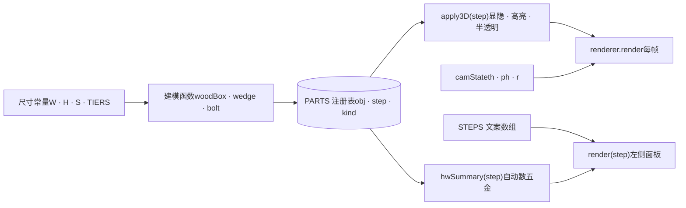

## 目录

1. [00先看全貌](#map)
2. [01最小场景](#l1)
3. [02坐标和单位](#l2)
4. [03场景图和 Group](#l3)
5. [04斜腿：挤出形状](#l4)
6. [05光和阴影](#l5)
7. [06材质和贴图](#l6)
8. [07相机和两个 bug](#l7)
9. [08点选和标签](#l8)
10. [09分步装配](#l9)
11. [10响应式和坑](#l10)
12. [11代码 review](#review)
13. [12换成 React 写](#react)
14. [13练习和资料](#next)

THREE.JS · 用你自己的梯架当教材

# 从梯架学 *Three.js*

这份教程拆的是你的装配步骤页和 3D 定稿页的真实代码。每一课讲一个概念，贴出原代码，再给一个可以拖动、能改参数的小演示。你已经会 JS 和 React，所以只讲 three.js 多出来的那部分。

**梯架 1000 × 600 × 1340**拖动旋转

滚动到这里时加载

00

## 先看全貌：你会的和要新学的

three.js 是对 WebGL 的封装。WebGL 只会画三角形，three.js 帮你管理"场景里有什么、在哪、长什么样、从哪看"。和你熟悉的前端开发比，概念上是这样对应的：

| 你熟悉的（React / DOM） | three.js 里对应的 |
| --- | --- |
| 组件树、DOM 树 | 场景图：一棵 `Object3D` 树（`Scene`、`Group`、`Mesh`） |
| 位置由布局引擎算 | 每个物体自己设 `position` / `rotation` / `scale`，父级的变换会叠加到子级 |
| `<div>` + CSS | `Mesh` = 几何体（形状）+ 材质（外观） |
| 状态变了自动重绘 | 自己调用 `renderer.render(scene, camera)`，不调就不更新 |
| `onClick` | 没有现成事件。用 `Raycaster` 从鼠标位置打一条射线去求交 |
| 组件卸载自动回收 | 自己 `dispose()` 几何体、材质、贴图，否则显存泄漏 |
| px、rem | 没有固定单位，你自己定。这两个页面全部用**毫米** |

### 装配步骤页的结构

整个页面是一个 HTML 文件、一个立即执行函数。数据从左往右流：尺寸常量决定零件形状，零件建一次就登记进 `PARTS`，之后切换步骤只是根据步骤号改每个零件的显隐和材质。



如果你用 React 写过"数据 → 视图"，后面第 9 课会很眼熟：`apply3D` 就是手写的 render 函数，只不过它改的是 three.js 对象的属性，不是 DOM。

第 01 课

## 最小场景：场景、相机、渲染器

- **Scene** 装东西；**Camera** 决定从哪看；**WebGLRenderer** 把它画到一个 `<canvas>` 上。
- `PerspectiveCamera(fov, aspect, near, far)`：`fov` 是**竖直方向**的视角（度）。`aspect` 必须等于画布的宽 ÷ 高，否则画面会被拉扁。`near` / `far` 之外的东西不画，我用毫米，所以设成 10 和 30000。
- `render()` 只画一帧。要动起来就每帧调用一次（`requestAnimationFrame`），或者只在东西变了的时候调用（这份教程的演示都是这么做的，省电）。

最小可运行版本 · 现代写法（npm + ES module）

```

```

你的两个页面没用 npm，而是从 cdnjs 加载 r128 版本，它会挂一个全局变量 `THREE`。代码里的 `const T = THREE` 只是起个短名，`new T.Mesh()` 和 `new THREE.Mesh()` 是一回事。

assembly-steps.html · 场景初始化

```

```

**演示：视角 fov**拖动旋转

滚动到这里时加载

fov34° [x] 同时调距离，让架子大小不变

```

```

勾着"大小不变"时拖 fov：fov 小，相机得退得很远，画面像长焦镜头，透视很弱；fov 大，相机贴得很近，近大远小很夸张。我选 34°，接近人眼看一件家具的感觉，尺寸关系不会被透视骗。

第 02 课

## 坐标和单位：让图纸数字直接当坐标

- three.js 是右手坐标系，**y 轴朝上**。红色是 x，绿色是 y，蓝色是 z。
- 我给这个项目定的约定：**x** = 从左侧架外侧往右量的宽度，**y** = 离地高度，**z** = 离墙距离（墙在 z = 0，往外为正）。单位全是毫米。这样施工图上"托条上沿离地 772""前裙板离墙 564"可以原样写进代码。
- `BoxGeometry` 的原点在盒子**正中心**，但图纸上量的是边。`woodBox` 帮你换算：传进去"左、下、靠墙那个角 + 长宽高"，它把 `position` 设成角点加一半尺寸。

assembly-steps.html · 尺寸常量

```

```

assembly-steps.html · 按角点放板子

```

```

**演示：一块 1000 × 22 × 140 的板**拖动旋转 · 橙色小球是你输入的那个点

滚动到这里时加载

x y z [x] 按角点定位（woodBox 的做法）

```

```

取消勾选后，同样的数字被当成板子中心，板子有一半钻进墙里、一半钻到地下。这就是为什么所有零件都走 `woodBox`。

第 03 课

## 场景图和 Group：子物体跟着父级走

- `Group` 是一个看不见的容器，就像一个没有样式的 `<div>`。子物体的 `position` 是**相对父级**的。
- 所有零件都挂在一个 `root` 上，`root.position.x = -W/2`。零件照样按"从左侧架外侧量"写坐标，整个架子却居中在世界原点，相机绕原点转起来最方便。
- 需要在两套坐标间换算时用 `getWorldPosition()` 和 `worldToLocal()`。零件编号标签就是这样放的：先求零件在世界里的包围盒中心，再换回 `root` 的坐标。

assembly-steps.html · root 和标签定位

```

```

**演示：左侧架是一个 Group**小坐标轴是 Group 自己的，大的是世界的

滚动到这里时加载

Group x Group 转角

```

```

注意看读数：托条 E2 的局部坐标一直不变，变的只有世界坐标。

第 04 课

## 斜腿：在侧视图里画轮廓，再挤出板厚

- 斜腿和托条前端都是斜的，长方体做不出来。办法是在侧视图（z–y 平面）里用 `Shape` 画出轮廓，再用 `ExtrudeGeometry` 沿厚度方向拉出 22 mm。
- `ExtrudeGeometry` 永远在自己的 x–y 平面里画，沿自己的 +z 挤出。我们画的是"z（离墙）, y（高度）"，所以要把它转一下：`rotation.y = -π/2` 让轮廓的 x 变成世界的 z，挤出方向变成世界的 −x，于是再把 `position.x` 补上一个板厚。
- 改形状就要建一个新的几何体。旧的那个要 `dispose()`，不然显存里会一直留着。

assembly-steps.html · wedge 和斜腿的四个角

```

```

**演示：拖斜率，看斜腿和"小三角"**拖动旋转

滚动到这里时加载

斜率 S 高 H [ ] 线框

```

```

读数里的"小三角偏移"就是施工图上让你在板边量 28 mm 再连线切掉的那个数：板宽 140 × 斜率。

第 05 课

## 光和阴影

- 受光材质在没有灯的场景里是全黑的。我用了三盏：**HemisphereLight**（上方天空色、下方地面色的环境光，便宜又自然）、主光 **DirectionalLight**（平行光，像太阳，负责投影）、一盏从背后打的弱补光，免得背面死黑。
- 阴影要四处都打开：`renderer.shadowMap.enabled`、灯的 `castShadow`、物体的 `castShadow`、地面的 `receiveShadow`。少一处就没有。
- 平行光的阴影是用一个**正交相机**从灯的位置拍一张深度图得到的。这个相机的盒子（left / right / top / bottom）要刚好包住架子：太小，盒子外没有阴影；太大，阴影变糊。勾上"显示阴影相机"能看到它。
- `shadow.bias` 是个很小的负数，用来消除表面自己挡自己产生的条纹（shadow acne）。

assembly-steps.html · 灯光

```

```

**演示：移动太阳**拖动旋转

滚动到这里时加载

方位 高度角 环境光 [x] 投影 [ ] 显示阴影相机

第 06 课

## 材质和贴图：木纹是现画的

- **MeshBasicMaterial** 不受光，永远一个颜色；**MeshLambertMaterial** 只算漫反射，便宜，两个页面全用它；**MeshStandardMaterial** 是物理材质，有粗糙度、金属度，更真实也更耗性能。
- 木纹不是图片文件，是用一个 `<canvas>` 现画几十条带随机起伏的线，再用 `CanvasTexture` 当贴图。这样整个页面还是一个 HTML 文件，不用加载图片。
- 一个 `BoxGeometry` 的 6 个面可以各给一个材质，顺序是 +x、−x、+y、−y、+z、−z。`matsFor` 找出最长的那条轴，给它两端的端面贴"空心孔"贴图，其余面贴木纹。所以你转到板子端头能看到塑木的空心。

assembly-steps.html · 木纹贴图和六面材质

```

```

**演示：一截 600 长的板**转到端头看空心孔

滚动到这里时加载

贴图 材质 粗糙度

第 07 课

## 相机：球坐标，以及你发现的两个 bug

- 我没用现成的 `OrbitControls`，而是自己存四样东西：看向的点 `t`、水平转角 `th`、从正上方往下偏的角度 `ph`、距离 `r`。每次把它们换算成 `camera.position`，再 `lookAt(t)`。拖动鼠标就是改 `th` 和 `ph`；每一步的预设视角也只是一组 th / ph / r，切换步骤时在两组之间插值。
- **bug 1，不能从下往上看：**`ph` 被限制在 1.55（约 89°），相机最低只能到看点那么高。`ph` 超过 90° 相机就到了看点下面，把上限放到 2.8 就行。
- **bug 2，窄屏只看到一部分：**`fov` 管的是竖直方向。画布变窄时竖直范围不变，水平范围按宽高比缩小，左右就被裁掉了。修法是按"参考宽高比 ÷ 当前宽高比"把相机拉远。

assembly-steps.html · 相机（已修复版）

```

```

**演示：复现两个 bug**把画布宽度拉到 40%，再取消"补偿"

滚动到这里时加载

th ph r 画布宽度 [x] 允许到地面以下（ph 上限 2.8） [x] 按宽高比补偿距离

```

```

新项目建议直接用 `OrbitControls`，上面这些它都有现成的参数：

同样的事用 OrbitControls 写

```

```

第 08 课

## 点选和标签：Raycaster 与 Sprite

- 画布里没有 DOM 元素可以绑 `onClick`。要知道鼠标下是哪颗螺栓：把鼠标位置换成 −1 到 1 的"标准化设备坐标"，从相机打一条射线，`intersectObjects` 返回按距离排好的命中列表，取第一个。
- 只对需要的物体求交。3D 定稿页里只对五金求交，木板不参与，数量少就快，也不会被木板"抢"走悬停。
- 信息挂在 `mesh.userData` 上（three.js 专门留给你放自定义数据的地方），命中后直接读出来填进提示框。
- 零件编号标签：用 canvas 画一个圆角色块加文字，做成 `Sprite`。Sprite 永远正对相机。`depthTest: false` 让它不被木板挡住，代价是零件多时标签会叠在一起。

ladder-final.html · 悬停提示

```

```

assembly-steps.html · 零件编号标签

```

```

**演示：鼠标移到橙色螺栓上**手机上点一下

滚动到这里时加载

[x] 零件编号标签 [ ] 标签参与遮挡（depthTest）

第 09 课

## 分步装配：数据驱动，和 React 一个思路

- 所有零件在页面加载时**只建一次**，每个都登记进 `PARTS`：对应的 three.js 对象、第几步装、是木头还是五金、用哪套材质。
- 切换步骤时不新建也不删除任何东西，只按当前步骤号**派生**每个零件的状态：步骤号 ≥ 它的 step 就显示；正好等于就换成高亮材质；勾了"之前装好的变半透明"就把旧材质的 `opacity` 调低。
- 左侧面板"这一步的五金 × 28"也是从 `PARTS` 数出来的，不是手写的。改了设计，数量自动跟着变。
- 改材质的 `transparent` 这类会影响着色器的属性后，要设 `material.needsUpdate = true`，three.js 才会重新编译。半透明物体还要关 `depthWrite`，不然会把后面的东西挡掉。

assembly-steps.html · 注册表和 apply3D

```

```

**演示：五步装完**拖动旋转

滚动到这里时加载

[ ] 之前装好的变半透明

```

```

第 10 课

## 响应式，以及页面层面的坑

- 画布大小变了要做三件事：更新 `camera.aspect`、调 `updateProjectionMatrix()`、`renderer.setSize()`。只监听 `window.resize` 不够，侧栏收起、网格重排都会改变画布大小，用 `ResizeObserver` 盯住画布的容器。
- `setPixelRatio(Math.min(devicePixelRatio, 2))`：手机屏的像素比可能是 3，按 3 渲染要画 9 倍的像素，帧率会掉，2 就够清楚了。
- 手机上要能拖动 3D，画布要设 `touch-action: none`，但这样手指放在画布上就滚不动页面了。整屏应用（装配页）用 none；嵌在长页面里的（这份教程）用 `pan-y`，竖着划滚动页面，横着划转模型。

assembly-steps.html · 尺寸变化

```

```

你遇到的"手机上只看到一部分"，一半原因其实在 CSS，和 three.js 无关：

两个 CSS 坑和修法

```

```

11

## 代码 review：哪里写得好，哪里该改

按"已经修掉的 bug、还在的技术债、小问题、值得保留的做法"排。技术债那几条是你以后自己写时最该避开的。

已修

#### 提示层的 `display` 覆盖了 `hidden`

`#fail{display:grid}` 的优先级高于浏览器默认的 `[hidden]{display:none}`，"3D 没能启动"的提示一直盖在模型上面。你之前看到的就是这个。

规则：用 `hidden` 属性控制显隐的元素，自己的 CSS 里不要设 `display`，或者补一条 `#fail[hidden]{display:none}`。

已修

#### 窄屏时页面被撑宽、模型被裁

CSS 那一半见第 10 课；相机那一半见第 7 课。

已修

#### 相机到不了地面以下

`ph` 上限 1.55 改成 2.8，从下往上看时把实心地面隐藏，只留网格。

不一致

#### 同一套尺寸在三个文件里各写了一遍

装配页、3D 定稿页各有一份 `W / H / S / TIERS`，施工图的侧视图是另一个 Python 脚本生成的。这次改尺寸我改了三处，而且已经出现了偏差：第 1 层前裙板角码那颗螺栓，装配页按离墙 518 画，定稿页按 514 画（施工图写的是离立柱背面 469，也就是离墙 514）。写这份 review 时发现的，装配页已经改成 514。差 4 mm 看不出来，但这种结构迟早会出错。

改法：抽一个 `shelf-geometry.js`，只导出数字和派生函数（`legBack`、`tierDepth`、螺栓位置），三个页面都从它取。

技术债

#### 900 行全在一个立即执行函数里

尺寸、建模、材质、步骤文案、左侧面板、相机、事件全混在一起。单文件是为了能直接发布成一个页面，代价是改哪里都得翻整个文件。

改法：用 Vite 分成 `geometry.js`（数字）、`parts.js`（建模 + 注册表）、`steps.js`（文案数据）、`viewer.js`（场景、相机、渲染）、UI 层（React 或 Vue）。最后再打包成一个文件发布。

技术债

#### 自己写相机控制

好处是每一步的视角就是一组数字，插值很直接。坏处是没有惯性、滚轮缩放不朝着鼠标、手机双指只能缩放不能平移，这两个 bug 也是自己写才会有的。`OrbitControls` 这些都有，补间时改 `controls.target` 和 `camera.position` 就行。

技术债

#### 每帧都在渲染，即使什么都没动

装配页的 `loop()` 每秒画 60 次。静态示意图大部分时间画面不变，笔记本风扇会转、手机会热。改法是"按需渲染"：只在拖动、补间、切步骤时调用 render，这份教程的演示就是这么做的（看 `invalidate()`）。

技术债

#### "半透明"改的是共享材质

同一类零件共用一个材质对象，勾"之前装好的变半透明"时直接改这些共享材质的 `opacity`。这是全局副作用：哪天想让某一个零件单独半透明就做不到，还容易和高亮逻辑互相覆盖。改法：半透明版本单独建一套材质，像高亮那样整套换。

技术债

#### 从不 `dispose()`

独立页面关掉就全部释放，所以没出问题。放进 React / Vue 单页应用里，组件卸载时不释放几何体、材质、贴图和 renderer，切几次路由显存就满了。

技术债

#### three.js 版本停在 r128（2021 年）

cdnjs 上 three.js 只更新到 r128，所以选了它。新版本只发 ES module，`examples/js` 已删除；r152 起默认按 sRGB 输出颜色，r155 起灯光强度改成物理单位。把我的代码搬到新版，画面会偏暗、偏色，灯光强度要重新调。

小问题

#### 几百个螺栓、螺丝各是一个 Mesh

每颗都 `new CylinderGeometry`，几何体都没共享。几百个还撑得住；上千个就该共享几何体，再进一步用 `InstancedMesh` 一次画完。

小问题

#### 贴图用 `Math.random()`

每次刷新木纹都不一样。定稿页的植物已经用了带种子的 `rng(42)`，贴图也该这样，截图对比时才稳定。

小问题

#### 死代码

`grid.visible = n !== 1 ? true : true;` 两个分支一样，是改来改去留下的，删掉。

值得保留

#### 真实毫米 + 图纸坐标

代码里的数字和施工图一一对应，核对尺寸时不用换算。这是整个项目最省事的一个决定。

值得保留

#### 零件建一次，状态派生

`PARTS` + `apply3D` 的结构让 22 步共用一套模型，五金数量自动统计。换成 React 写时这个结构几乎不用改（第 12 课）。

值得保留

#### 小函数建模

`woodBox`、`wedge`、`bolt`、`bracket` 各管一种零件，组合起来就是整个架子。以后做别的家具，这几个函数可以直接带走。

12

## 换成 React 写：react-three-fiber

你熟悉 React，以后自己做这类示意图，最顺手的是 **react-three-fiber**（R3F）：它把 three.js 对象变成 JSX 组件，`<mesh>` 就是 `new THREE.Mesh()`，属性就是 props。配套的 **drei** 提供 OrbitControls、文字标签、阴影等现成组件。Vue 那边对应的是 **TresJS**。

上面的分步装配换成 R3F 大概是这样。`PARTS` 变成普通数据数组，步骤是 React 状态，显隐和高亮由渲染派生，和第 9 课的思路一样，只是不用手写 `apply3D`：

Assembly.jsx · react-three-fiber 版骨架

```

```

**什么时候不用 R3F：**只是一个独立页面、不需要和别的 React 状态交互时，原生 three.js 更直接，也更容易看懂底层发生了什么。建议先用原生写一个小东西把这份教程的概念走一遍，再换 R3F。

从零起一个项目

```

```

13

## 练习和资料

练习都用这个梯架，难度从低到高。每一个都是你自己的项目里真用得上的改进。

1. **抽出尺寸模块。**用 Vite 起一个项目，把 `W / H / S / TIERS / legBack / tierDepth` 放进 `geometry.js`，用 `woodBox` 和 `wedge` 搭出两片侧架。对照施工图检查螺栓位置。
2. **换成 OrbitControls。**保留"每一步一个预设视角"：切换步骤时补间 `controls.target` 和 `camera.position`，每帧调 `controls.update()`。
3. **改成按需渲染。**去掉每帧的 loop，只在 `controls` 的 `change` 事件和补间进行时渲染。用浏览器性能面板对比前后的 CPU 占用。
4. **螺丝改用 InstancedMesh。**80 颗螺丝一个几何体、一个材质、一次绘制。提示：`setMatrixAt(i, matrix)`。
5. **加尺寸标注。**在侧视角下画出"净高 650""净高 450"的尺寸线（`Line` + Sprite 标签），切步骤时只显示和这一步相关的。
6. **导出模型。**用 `GLTFExporter` 把整个架子导出成 `.glb`，拖进 glTF 查看器检查，以后也能放进别的 3D 软件。

### 资料

- [three.js 官方手册（有中文）](https://threejs.org/manual/#zh/fundamentals)：按主题讲概念，从"基础"读到"阴影""拾取"就够做这类示意图。
- [three.js API 文档](https://threejs.org/docs/) 和 [官方示例](https://threejs.org/examples/)：示例页每个都能看源码，遇到"这个效果怎么做"先在这里搜。
- [Discover three.js](https://discoverthreejs.com/)：一本免费的在线书，讲项目怎么组织，正好对应 review 里"拆模块"那几条。
- [react-three-fiber 文档](https://r3f.docs.pmnd.rs/)，Vue 用 [TresJS](https://tresjs.org/)。
- [Three.js Journey](https://threejs-journey.com/)：付费视频课，系统、口碑好，想深入着色器再考虑。

本页演示用的是和装配页相同的 three.js r128 与相同的尺寸数字。代码片段摘自 assembly-steps.html 和 ladder-final.html 当前版本，个别地方删了与本课无关的行。