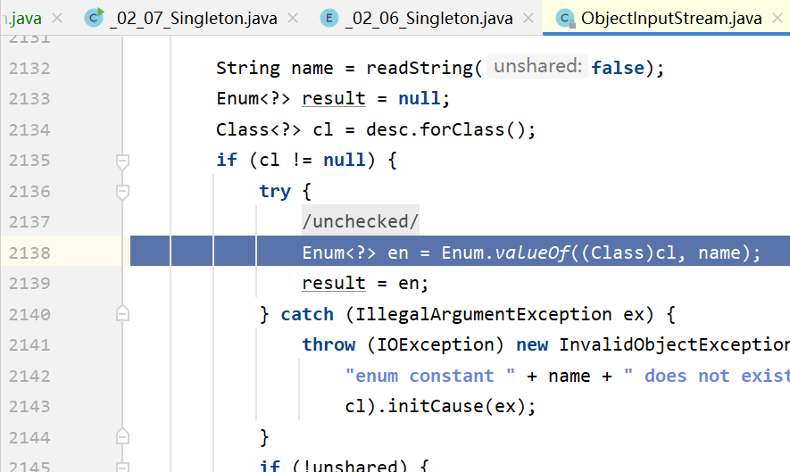
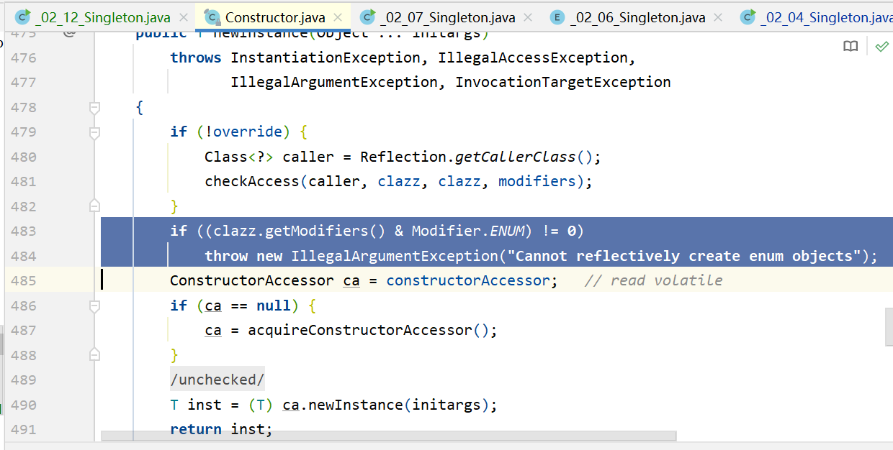

<a name="jsDxP"></a>

## 序列化问题

<a name="CT8Np"></a>

### 问题引入

<a name="nkR9v"></a>

### 实例代码

首先要将前一篇文章的[单例](<01.创建型模式_ 单例模式(Singleton Pattern).md>)实例加上`Serializable`接口, 否则会抛出`java.io.NotSerializableException`的异常.

```java

public class _02_04_Singleton implements Serializable {
	// ....
}
```

然后对这个对象进行序列化和反序列化操作, 代码如下:

```java
/**
 * 序列化破坏
 */
public class _02_11_Singleton {
    private void serializeObject(Serializable s) throws IOException {
        // 新建一个对象输出流, 并且指定输出的位置
        ObjectOutputStream oos = new ObjectOutputStream(new FileOutputStream("singleton_serializable"));
        // 将单例对象实例化
        oos.writeObject(s);
    }

    private Serializable deserializeObject() throws IOException, ClassNotFoundException {
        // 读取该单例对象
        File file = new File("singleton_serializable");
        // 获取对象输入流
        ObjectInputStream ois = new ObjectInputStream(new FileInputStream(file));
        // 反序列化单例对象
        return (Serializable) ois.readObject();

    }
    public static void main(String[] args) throws IOException, ClassNotFoundException {
        _02_11_Singleton operation = new _02_11_Singleton();
        // 获取单例对象
        _02_04_Singleton singleton1 = _02_04_Singleton.getInstance();
        _02_04_Singleton singleton2 = _02_04_Singleton.getInstance();
        _02_04_Singleton singleton3 = _02_04_Singleton.getInstance();

        operation.serializeObject(singleton1);

        _02_04_Singleton newSingleton = (_02_04_Singleton) operation.deserializeObject();

        _02_04_Singleton singleton4 = _02_04_Singleton.getInstance();
        
        System.out.println(singleton1);
        System.out.println(singleton2);
        System.out.println(singleton3);
        System.out.println(singleton4);
        System.out.println(newSingleton);
    }
}


```

    cc.stevenyin.design_pattern._02_04_Singleton@2669b199
    cc.stevenyin.design_pattern._02_04_Singleton@2669b199
    cc.stevenyin.design_pattern._02_04_Singleton@2669b199
    cc.stevenyin.design_pattern._02_04_Singleton@2669b199
    cc.stevenyin.design_pattern._02_04_Singleton@3a82f6ef

从打印结果可以看出, 单例模式已经被破坏, 因为新建出了两个不同的"单例"对象. <a name="tSjUY"></a>

### 解决方式

<a name="oU1Jb"></a>

####

可以看到，**序列化和反序列化破坏了单例模式。**
**对于这个问题，JDK早已提供了解决方案，那就是在单例类中提供一个**`**readResolve**`**方法**

> The readResolve method is called when ObjectInputStream has read an object from the stream and is preparing to return it to the caller. ObjectInputStream checks whether the class of the object defines the readResolve method. If the method is defined, the readResolve method is called to allow the object in the stream to designate the object to be returned.
> ——https://docs.oracle.com/javase/8/docs/platform/serialization/spec/input.html#a5903

当`ObjectInputStream`从流中读取一个对象并准备将其返回给调用方时，将调用`readResolve`方法。 `ObjectInputStream`检查对象的类是否定义了`readResolve`方法。如果定义了该方法，则将调用`readResolve`方法，以允许流中的对象指定要返回的对象。
也就是说反序列化的时候，JDK提供了一个钩子函数来让开发者指定要返回的对象，用法如下

```java
public class _02_04_Singleton implements Serializable {
    // ... 上面代码省略
    public Object readResolve() {
        return instance;
    }
    // ... 下面代码省略
}
```

此时我们再次调用之前的测试代码, 我们发现单例的对象已经正常了, 不会再创建新的对象了:

    cc.stevenyin.design_pattern._02_04_Singleton@2669b199
    cc.stevenyin.design_pattern._02_04_Singleton@2669b199
    cc.stevenyin.design_pattern._02_04_Singleton@2669b199
    cc.stevenyin.design_pattern._02_04_Singleton@2669b199
    cc.stevenyin.design_pattern._02_04_Singleton@2669b199

因为在`ObjectOutputStream`的源码的方法`java.io.ObjectInputStream#readOrdinaryObject`中, 有一段判断逻辑:

```java
....
    if (obj != null &&
            handles.lookupException(passHandle) == null &&
            desc.hasReadResolveMethod())
        {
            Object rep = desc.invokeReadResolve(obj);
        ....
        }
```

它会去判断, 待反序列化的这个对象中有没有`readResolve`这个方法, 如果有的话回去调用这个方法来进行反序列化, 否则的话则使用构造进行新建.
这个方法没有任何的提示, 不是通过继承或者重写某些方法实现的, 单纯就是定义一个返回值是`Object`, 方法名是`readResolve`的方法丢在那里就好了. <a name="e1zP6"></a>

## 反射攻击

这种方法非常简单暴力，通过反射侵入单例类的私有构造方法并强制执行，使之产生多个不同的实例， 这样单例就被破坏了。

```java
public class _02_12_Singleton {
    public static void main(String[] args) throws IOException, ClassNotFoundException, NoSuchMethodException, InvocationTargetException, InstantiationException, IllegalAccessException {
        Class objectClass = _02_04_Singleton.class;
        // 获取单例类的构造函数
        Constructor constructor = objectClass.getDeclaredConstructor();
        // 打开private构造函数的权限
        constructor.setAccessible(true);
        // 通过反射的形式创建对象
        _02_04_Singleton singleton = (_02_04_Singleton) constructor.newInstance();
        // 获取单例对象
        _02_04_Singleton singleton1 = _02_04_Singleton.getInstance();
        _02_04_Singleton singleton2 = _02_04_Singleton.getInstance();
        System.out.println(singleton1);
        System.out.println(singleton2);
        System.out.println(singleton);
    }
}

```

要防御反射攻击，只能在单例构造方法中检测`instance`是否为`null`，如果已不为 `null`，就抛出异常。显然双重检查锁实现无法做这种检查，静态内部类实现则是可以的。&#x20;
懒汉式防御反射攻击代码:

```java
package cc.stevenyin.design_pattern;

import java.io.Serializable;
import java.util.Date;
import java.util.Random;

/**
 * 懒汉式(Double Check)
 */
public class _02_04_Singleton {
    private static volatile _02_04_Singleton instance;
    private String name;
    private Date date;

    private _02_04_Singleton() {
        if (instance != null) {
            throw new IllegalArgumentException("can not initialize singleton object!");
        }
        try {
            Thread.sleep(new Random().nextInt(10000));
            date = new Date();
            name = "stevenyin";
        } catch (InterruptedException e) {
            e.printStackTrace();
        }
    }

    public static _02_04_Singleton getInstance() {
        if (instance == null) {
            synchronized (_02_04_Singleton.class) {
                if (instance == null) {
                    instance = new _02_04_Singleton();
                }
            }
        }
        return instance;
    }

    public String getName() {
        return name;
    }

    public Date getDate() {
        return date;
    }
}


```

> 注意，不能在单例类中添加类初始化的标记位或计数值（比如 boolean flag 、 int count ）来 防御此类攻击，因为通过反射仍然可以随意修改它们的值。

    Exception in thread "main" java.lang.reflect.InvocationTargetException
    	at java.base/jdk.internal.reflect.NativeConstructorAccessorImpl.newInstance0(Native Method)
    	at java.base/jdk.internal.reflect.NativeConstructorAccessorImpl.newInstance(NativeConstructorAccessorImpl.java:62)
    	at java.base/jdk.internal.reflect.DelegatingConstructorAccessorImpl.newInstance(DelegatingConstructorAccessorImpl.java:45)
    	at java.base/java.lang.reflect.Constructor.newInstance(Constructor.java:490)
    	at cc.stevenyin.design_pattern._02_12_Singleton.main(_02_12_Singleton.java:22)
    Caused by: java.lang.IllegalArgumentException: can not initialize singleton object!
    	at cc.stevenyin.design_pattern._02_04_Singleton.<init>(_02_04_Singleton.java:17)
    	... 5 more

    Process finished with exit code 1

<a name="s1br8"></a>

### 结论: 懒汉式无法完全避免反射攻击

那么如果是**饿汉式**或者**静态内部类**的形式, 因为在`<clinit>`就已经创建了对象, 所以在这之后正常情况下就不会再调用构造函数了, 所以我们可以在构造函数中增加空值异常来防止反射攻击.
饿汉式单例模式阻止反射攻击的代码:

```java
package cc.stevenyin.design_pattern;

/**
 * 懒汉式 - 静态内部类
 */
public class _02_05_Singleton {
    private _02_05_Singleton() {
        if (getInstance() != null) {
            throw new IllegalArgumentException("can not initialize singleton object!");
        }
    }

    public static _02_05_Singleton getInstance() {
        return Instance.INSTANCE;
    }

    private static class Instance {
        private static final _02_05_Singleton INSTANCE = new _02_05_Singleton();
    }
}

```

测试结果

```java
package cc.stevenyin.design_pattern;

import java.io.IOException;
import java.lang.reflect.Constructor;
import java.lang.reflect.InvocationTargetException;

/**
 * 反射攻击
 */
public class _02_12_Singleton {
    public static void main(String[] args) throws IOException, ClassNotFoundException, NoSuchMethodException, InvocationTargetException, InstantiationException, IllegalAccessException {

        // 获取单例对象
        _02_05_Singleton singleton1 = _02_05_Singleton.getInstance();
        _02_05_Singleton singleton2 = _02_05_Singleton.getInstance();

        Class objectClass = _02_05_Singleton.class;
        // 打开private构造函数的权限
        // 获取单例类的构造函数
        Constructor constructor = objectClass.getDeclaredConstructor();
        constructor.setAccessible(true);
        _02_05_Singleton singleton = (_02_05_Singleton) constructor.newInstance();
        System.out.println(singleton1);
        System.out.println(singleton2);
        System.out.println(singleton);
    }
}

```

    Exception in thread "main" java.lang.reflect.InvocationTargetException
    	at java.base/jdk.internal.reflect.NativeConstructorAccessorImpl.newInstance0(Native Method)
    	at java.base/jdk.internal.reflect.NativeConstructorAccessorImpl.newInstance(NativeConstructorAccessorImpl.java:62)
    	at java.base/jdk.internal.reflect.DelegatingConstructorAccessorImpl.newInstance(DelegatingConstructorAccessorImpl.java:45)
    	at java.base/java.lang.reflect.Constructor.newInstance(Constructor.java:490)
    	at cc.stevenyin.design_pattern._02_12_Singleton.main(_02_12_Singleton.java:22)
    Caused by: java.lang.IllegalArgumentException: can not initialize singleton object!
    	at cc.stevenyin.design_pattern._02_05_Singleton.<init>(_02_05_Singleton.java:9)
    	... 5 more

<a name="ljZlz"></a>

## 使用枚举类避免上述两种攻击场景

<a name="kH1lz"></a>

### 避免序列化问题

<a name="ZSh5N"></a>

#### 实现代码:

```java
package cc.stevenyin.design_pattern;

/**
 * 懒汉式 - 枚举形式
 */
public enum _02_06_Singleton {
    INSTANCE;

    public static _02_06_Singleton getInstance() {
        return INSTANCE;
    }
    @Override
    public String toString() {
        return getClass().getName() + "@" + Integer.toHexString(hashCode());
    }
}

```

<a name="mzToG"></a>

#### 测试代码:

```java
package cc.stevenyin.design_pattern;

import java.io.*;

/**
 * 序列化破坏
 */
public class _02_11_Singleton {
    private void serializeObject(Serializable s) throws IOException {
        // 新建一个对象输出流, 并且指定输出的位置
        ObjectOutputStream oos = new ObjectOutputStream(new FileOutputStream("singleton_serializable"));
        // 将单例对象实例化
        oos.writeObject(s);
    }

    private Serializable deserializeObject() throws IOException, ClassNotFoundException {
        // 读取该单例对象
        File file = new File("singleton_serializable");
        // 获取对象输入流
        ObjectInputStream ois = new ObjectInputStream(new FileInputStream(file));
        // 反序列化单例对象
        return (Serializable) ois.readObject();

    }
    public static void main(String[] args) throws IOException, ClassNotFoundException {
        // 获取单例对象
        _02_06_Singleton singleton1 = _02_06_Singleton.getInstance();
        _02_06_Singleton singleton2 = _02_06_Singleton.getInstance();
        _02_06_Singleton singleton3 = _02_06_Singleton.getInstance();
        _02_11_Singleton operation = new _02_11_Singleton();
        operation.serializeObject(singleton1);
        _02_06_Singleton newSingleton = (_02_06_Singleton) operation.deserializeObject();
        _02_06_Singleton singleton4 = _02_06_Singleton.getInstance();
        System.out.println(singleton1);
        System.out.println(singleton2);
        System.out.println(singleton3);
        System.out.println(singleton4);
        System.out.println(newSingleton);
    }
}


```

    cc.stevenyin.design_pattern._02_06_Singleton@60f82f98
    cc.stevenyin.design_pattern._02_06_Singleton@60f82f98
    cc.stevenyin.design_pattern._02_06_Singleton@60f82f98
    cc.stevenyin.design_pattern._02_06_Singleton@60f82f98
    cc.stevenyin.design_pattern._02_06_Singleton@60f82f98

对于枚举类, 不需要做任何的修改就可以实现序列化情况下的单例. 我们去查看一下ObjectInputStream的源码, 看到它在处理枚举类的时候, 使用了valueOf的方式, 并没有新建一个实例出来:

 <a name="wqfhh"></a>

### 避免反射攻击

对于枚举类来说, 它只有唯一的一个构造方法, 也就是

```java
    /**
     * Sole constructor.  Programmers cannot invoke this constructor.
     * It is for use by code emitted by the compiler in response to
     * enum type declarations.
     *
     * @param name - The name of this enum constant, which is the identifier
     *               used to declare it.
     * @param ordinal - The ordinal of this enumeration constant (its position
     *         in the enum declaration, where the initial constant is assigned
     *         an ordinal of zero).
     */
    protected Enum(String name, int ordinal) {
        this.name = name;
        this.ordinal = ordinal;
    }

```

并且注释中也写的很明白, 这个方法不是给我们程序员使用的.
如果我们尝试使用这个构造方法创建对象时, 会发生下面的事情.

```java
package cc.stevenyin.design_pattern;

import java.io.IOException;
import java.lang.reflect.Constructor;
import java.lang.reflect.InvocationTargetException;

/**
 * 反射攻击
 */
public class _02_12_Singleton {
    public static void main(String[] args) throws IOException, ClassNotFoundException, NoSuchMethodException, InvocationTargetException, InstantiationException, IllegalAccessException {

        // 获取单例对象
        _02_06_Singleton singleton1 = _02_06_Singleton.getInstance();
        _02_06_Singleton singleton2 = _02_06_Singleton.getInstance();

        Class objectClass = _02_06_Singleton.class;
        // 打开private构造函数的权限
        // 获取单例类的构造函数
        Constructor constructor = objectClass.getDeclaredConstructor(String.class, int.class);
        constructor.setAccessible(true);
        _02_06_Singleton singleton = (_02_06_Singleton) constructor.newInstance();
        System.out.println(singleton1);
        System.out.println(singleton2);
        System.out.println(singleton);
    }
}


```

```
Exception in thread "main" java.lang.IllegalArgumentException: Cannot reflectively create enum objects
	at java.base/java.lang.reflect.Constructor.newInstance(Constructor.java:484)
	at cc.stevenyin.design_pattern._02_12_Singleton.main(_02_12_Singleton.java:22)

```

我们发现, 反射类`Constructor`的源码中, 有这么一段逻辑, 如果发现这个构造方法属于枚举类, 就会报错:
 <a name="qUtSU"></a>

## 结论

[前文](<01.创建型模式_ 单例模式(Singleton Pattern).md>)提到的单例都会被序列化/反序列化、反射不同程度的破坏。解决序列化/反序列化靠JDK提供的钩子函数readResolve，想要解决反射也有一些办法，那就是在私有构造方法里加一下判断，如果INSTANCE不为null时，就抛出异常…
**想要更优雅的解决序列化/反序列化、反射的问题，还有一种更优雅的写法，那就是利用枚举**
