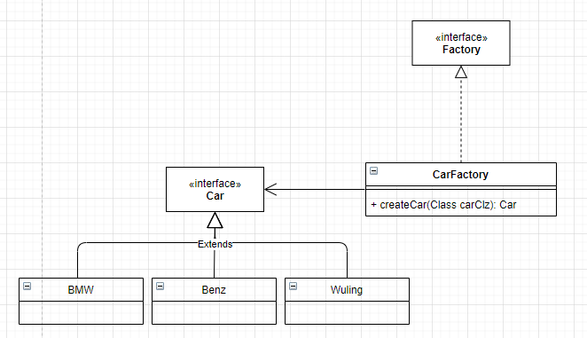

<a name="Rm3Ub"></a>

## 定义

工厂方法模式定义了一个用于创建对象的接口, 让这个接口的子类来决定实例化哪一个类, 工厂方法模式使得一个类的实例化延迟到其子类. <a name="b5kzn"></a>

## 类图



```kotlin
class _03_01_FactoryMethodPattern {
    interface ICarFactory {
        fun <T: ICar> create(clz: Class<T>): T
    }

    interface ICar {
        fun run()
    }

    class CarFactory : ICarFactory {
        override fun <T : ICar> create(clz: Class<T>): T {
            try {
                return Class.forName(clz.name).getDeclaredConstructor().newInstance() as T
            } catch (e: Exception) {
                println("无法识别的汽车类型: $clz")
                throw e
            }
        }
    }

    class BMW : ICar {
        override fun run() = println("我是一辆宝马 => @${Integer.toHexString(hashCode())}")
    }

    class Benz : ICar {
        override fun run() = println("我是一辆奔驰 => @${Integer.toHexString(hashCode())}")
    }

    class Wuling : ICar {
        override fun run() = println("我是一辆五菱宏光 => @${Integer.toHexString(hashCode())}")
    }

}

fun main() {
    val carFactory = _03_01_FactoryMethodPattern.CarFactory()
    val bmw = carFactory.create(_03_01_FactoryMethodPattern.BMW::class.java)
    val benz = carFactory.create(_03_01_FactoryMethodPattern.Benz::class.java)
    val wuling = carFactory.create(_03_01_FactoryMethodPattern.Wuling::class.java)
    bmw.run();
    benz.run();
    wuling.run();
}
```

<a name="AeZER"></a>

## 总结

<a name="Dclok"></a>

### 优点

1. 具有良好的封装性， 代码结构清晰， 一个对象的创建是有条件约束的，如一个调用者需要一个具体的产品对象， 只要知道这个产品的类名就可以了，不用知道对象创建的过程，降低模块间的耦合程度。
2. 工厂方法模式的扩展性非常优秀，如果我想要增加一种产品，除了增加一个新的`Class`以外, 其他的代码不用做任何修改. 而且因为都是通过统一工厂和接口实现, 如果在工厂创建对象的前后包含任何前置后置处理,都可以立即生效而不用重复编码.
3. 屏蔽了产品类的实现, 对外只提供产品的接口, 只要接口保持不变, 系统中的上层模块就不要发生变化, 因为产品类的实例化工作是由工厂类负责的, 一个产品对象具体由哪一个产品生成是由工厂类决定的
4. 工厂方法模式是典型的解耦框架, 高层模块只需要知道产品的抽象类, 其他的实现类都不关心, 符合**迪米特法则(我不需要的就不去交流); 符合依赖倒置原则(只依赖产品的抽象类而非具体实现); 符合里氏替换原则(使用子类替换父类)** <a name="nTzV4"></a>

### 工厂模式的常见使用场景

1. 在数据库开发中, 我们使用JDBC提供的接口, 往往只需要提供驱动名称, 修改对应jdbc配置, 就可以完成后续SQL操作(前提是SQL操作符合标准语句). 这种修改是非常灵活的
2. 我们设计一个连接邮件服务器的框架, 有三种网络协议可以选择, POP3, IMAP, HTTP. 我们就可以将三种连接方法作为产品类, 定义一个接口`IConnectMail`, 然后定义对邮件的操作方法, 用不同的方法实现三个具体的产品类. 再定义一个工厂类, 根据不同条件选择不同连接方式.
