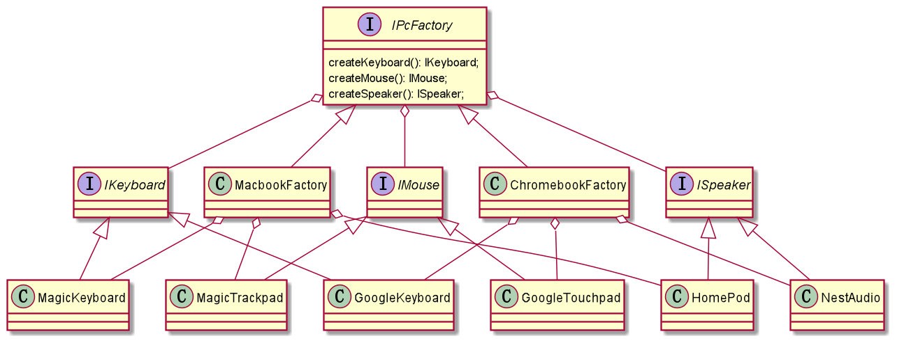

<a name="Rm3Ub"></a>

## 定义

为创建一组相关或相互依赖的对象提供一个接口, 而无需指定他们的具体类.
**(provides an interface for creating families of related or dependent objects without specifying their concrete classes)** <a name="b5kzn"></a>

## 类图



在抽象工厂模式中, 我们需要时刻记住一个概念, 也就是产品族, 也就是说每一个工厂类, 生产的是很多个子类(产品)的组合, 这个例子中, 我的工厂需要生产PC, 所以定义了一个`PcFactory`, 其中需要生产鼠标`IMouse`,键盘`IKeyboard`和音响`ISpeaker`. 但是有很多厂家都会去生产PC, 其中包括`Apple`和`Google`所以他们都去实现`PcFactory`接口, 然后分别各自生产自家的鼠标键盘音响.

```kotlin
class _04_01_AbstractFactoryPattern {
    interface IPcFactory {
        fun createKeyboard(): IKeyboard;
        fun createMouse(): IMouse;
        fun createSpeaker(): ISpeak;
    }

    interface IKeyboard
    class MagicKeyboard: IKeyboard
    class GoogleKeyboard: IKeyboard

    interface IMouse
    class MagicTrackpad: IMouse
    class GoogleTouchpad: IMouse

    interface ISpeak
    class HomePod: ISpeak
    class NestAudio : ISpeak

    class MacbookFactory: IPcFactory {
        override fun createKeyboard() = MagicKeyboard()
        override fun createMouse() = MagicTrackpad()
        override fun createSpeaker() = HomePod()
    }
    class ChromebookFactory: IPcFactory {
        override fun createKeyboard() = GoogleKeyboard()
        override fun createMouse() = GoogleTouchpad()
        override fun createSpeaker() = NestAudio()
    }
}

fun main() {
    val pcFactory01 = _04_01_AbstractFactoryPattern.ChromebookFactory()
    val pcFactory02 = _04_01_AbstractFactoryPattern.MacbookFactory()
    println(pcFactory01.createKeyboard())
    println(pcFactory01.createMouse())
    println(pcFactory01.createSpeaker())
    println(pcFactory02.createKeyboard())
    println(pcFactory02.createMouse())
    println(pcFactory02.createSpeaker())
}
```

    cc.stevenyin.design_pattern._04_01_AbstractFactoryPattern$GoogleKeyboard@57829d67
    cc.stevenyin.design_pattern._04_01_AbstractFactoryPattern$GoogleTouchpad@7e0ea639
    cc.stevenyin.design_pattern._04_01_AbstractFactoryPattern$NestAudio@7a0ac6e3
    cc.stevenyin.design_pattern._04_01_AbstractFactoryPattern$MagicKeyboard@6fadae5d
    cc.stevenyin.design_pattern._04_01_AbstractFactoryPattern$MagicTrackpad@2d6e8792
    cc.stevenyin.design_pattern._04_01_AbstractFactoryPattern$HomePod@2acf57e3

<a name="AeZER"></a>

## 总结

<a name="hvO1h"></a>

### 优点

1. 封装性, 每个产品的实现类不是高层模块需要关心的, 它只需要关心**接口**, 他不关心对象是如何创建出来的, 创建出来的对象是谁, 而真正需要关心这些的, 应该是工厂类.
2. 产品族内的约束为非公开状态, 具体产品族内部的约束是在工厂内部实现的. <a name="hsQWq"></a>

### 缺点

1. 抽象工厂模式最大的缺点就是**产品族的扩展非常困难**, 也就是说, 如果我们的产品组已经存在A,B两种产品, 现在想要增加一个产品C, 也就是说原来的产品族要由2个增加到3个, 首先我们要在最顶层的Factory接口增加`createC(): C`这样的接口, 然后对每一个具体的工厂实现类实现这个方法, **这严重违反了开闭原则**, 而且对于我们编码来说, 抽象类和接口这样的`high level`的设计是一个契约, 一旦契约改变, 所有依据这个契约运转的工作都要发生变化. <a name="F62Aw"></a>

### 注意事项

在抽象工厂模式的缺点中, 我们提到抽象工厂模式的产品族扩展比较困难, 但是对于**产品的等级**(类似于上面例子中的`Apple`和`Google`厂商)**的扩展是很容易的**, 我们如果想要增加一个产品等级, 比如华为, 我们只需要增加一个`HuaweiFactory`然后对这个工厂生产的每一个部件进行实现就好了, 这样的话对外暴露的任何接口都是统一的, 但是实现了不同的产品类, 达到了扩展的目的,** 如果这样看的话, 抽象工厂模式又是符合开闭原则的**.
