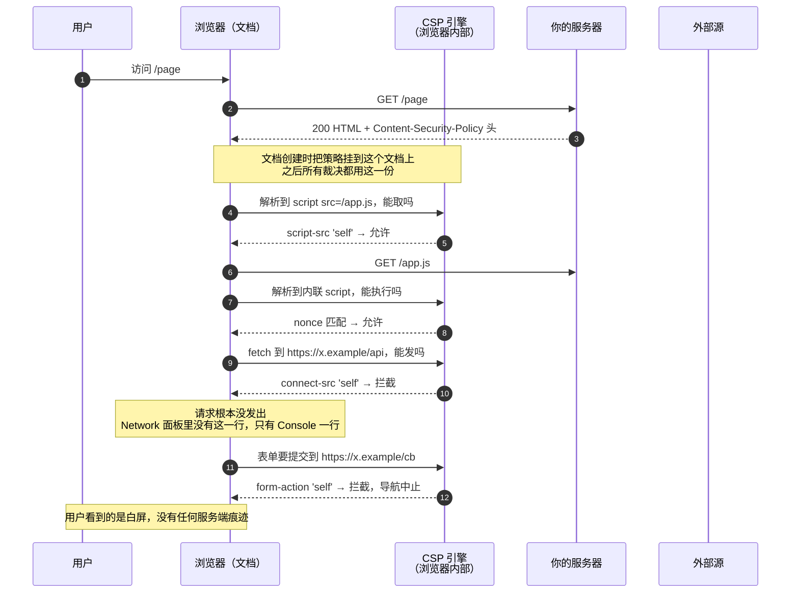
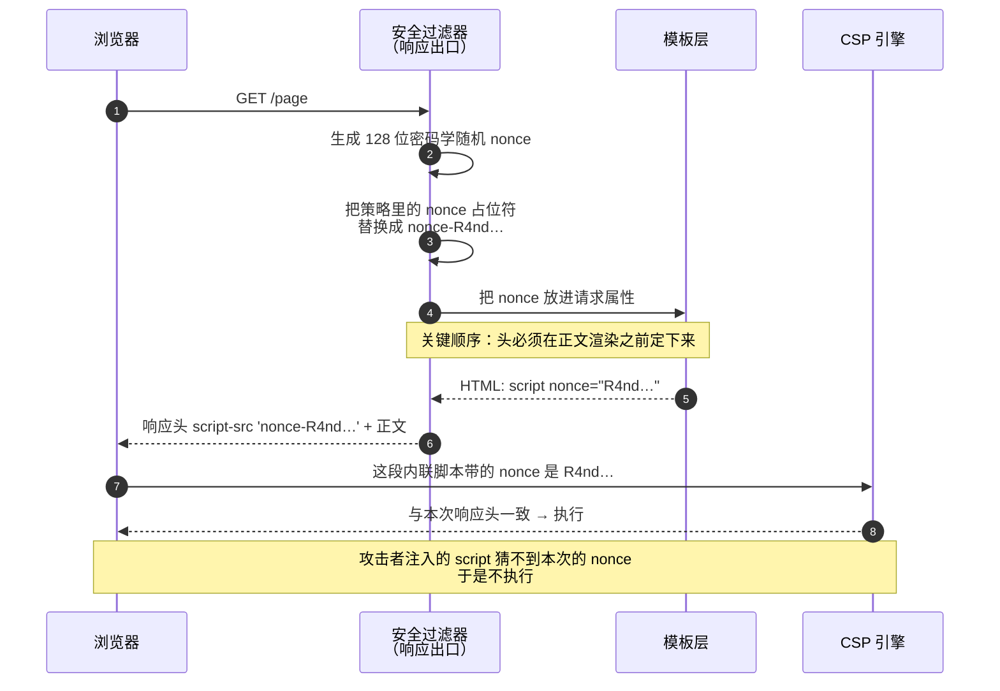
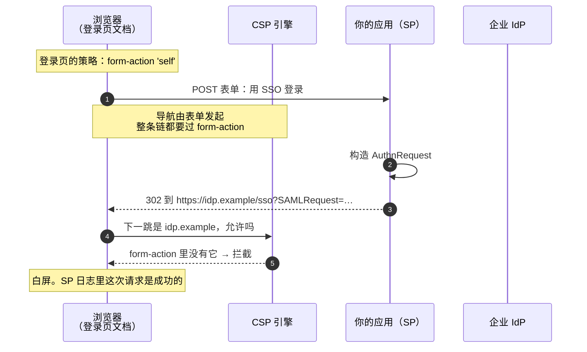
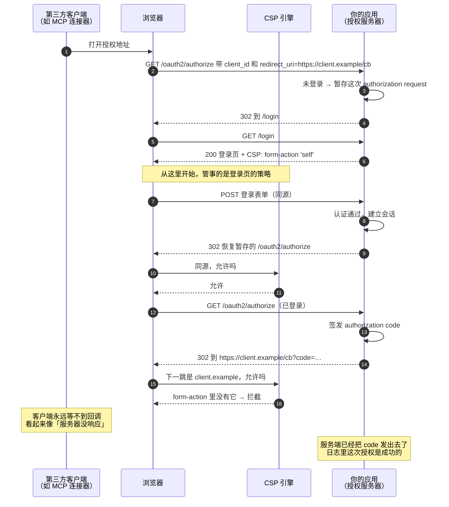
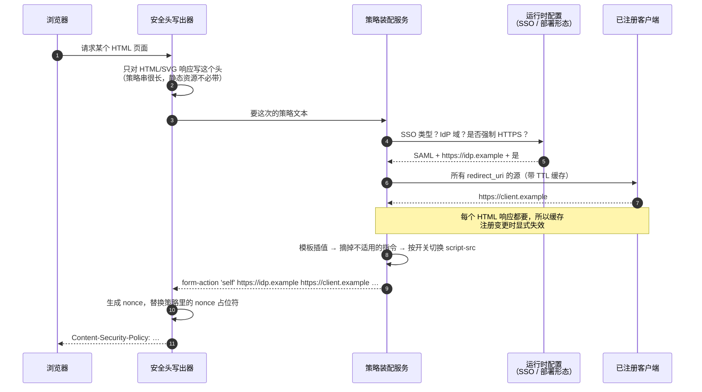
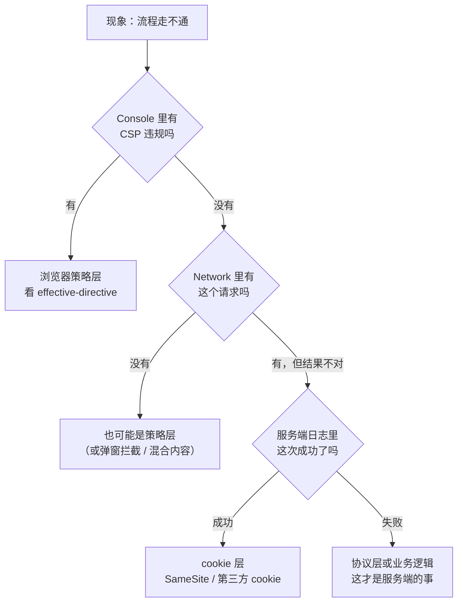

先描述一个故障现场，因为它比定义更能说明 CSP 是什么。

用户点「用企业账号登录」。服务端日志一切正常：请求进来了，认证通过了，会话建好了，`302` 也发出去了，响应码 200/302 一路干净。浏览器停在一个空白页。Console 里只有一行红字，指向的地址还是**我们自己的域**，看起来像是「`'self'` 拒绝了 self」。

服务端没有任何东西可查，因为**问题不在服务端**。有一个参与者从来不写日志、也不在任何时序图上出现，却对「能不能跳到那里」有独立的否决权：浏览器。

这篇把这份否决权讲清楚：它是什么、由谁声明、在浏览器的哪一环执行、为什么认证流程是它的高发区，以及在服务端应该怎么把这份策略生成出来。

---

## 一、CSP 想解决的问题：注入之后的那一半

先把它和同源策略分开，这两个东西经常被混着讲。

| | 管什么 | 谁定的 | 能否关掉 |
|---|---|---|---|
| **同源策略** SOP | 一个源的脚本**能不能读到**另一个源的数据 | 浏览器内置，默认行为 | 只能通过 CORS 由**被访问方**开口子 |
| **CSP** | 这个**文档**能加载什么、连到哪、跳到哪、被谁嵌 | **你自己**用响应头声明 | 你不声明就等于不限制 |

SOP 是「默认拒绝读取」，CSP 是「主动交出权限」。方向不同：SOP 保护的是**别人的**数据不被你读；CSP 保护的是**你的页面**不被别人利用。

### XSS 是两段式的，CSP 打第二段

一次成功的 XSS 需要两步：

1. **注入**——攻击者的字符串进入你的 HTML/JS 上下文；
2. **执行与外发**——这段脚本跑起来，然后把 cookie、token、页面内容送到攻击者的服务器。

CSP 对第一步毫无办法。它攻的是第二步：

- 脚本没有合法的来源标记（nonce/hash）或不在白名单里 → **不执行**，注入的收益归零；
- 就算执行了，`connect-src` / `img-src` 只允许同源 → **数据发不出去**，外发通道被掐断。

所以有一句必须记住：**CSP 是缓解层，不是修复层。** 它不替代输出转义和参数化查询。它的价值在于「当第一层失守时，把损失从『数据泄露』降级为『Console 里一行报错』」。

### 它实际管三件事

| 类别 | 典型指令 | 挡住的攻击 |
|---|---|---|
| 代码从哪来 | `script-src` `style-src` `object-src` | XSS、被投毒的第三方 CDN、老 Flash/插件 |
| 数据往哪去 | `connect-src` `img-src` `font-src` | 数据外发（exfiltration）、用图片 URL 打点回传 |
| 导航与嵌套 | `form-action` `frame-ancestors` `base-uri` | 表单被改道到钓鱼站、点击劫持、相对 URL 解析基准被篡改 |

第三类是最少被写对、也是本文后半的主角——因为**认证流程天然会触碰它**。

---

## 二、它是一份「文档级」的声明

### 两种投递方式

```http
Content-Security-Policy: default-src 'none'; script-src 'self'; form-action 'self'
```

也可以写在 HTML 里：

```html
<meta http-equiv="Content-Security-Policy" content="default-src 'none'; script-src 'self'">
```

`<meta>` 有硬限制，不要作为主要手段：它**不支持** `frame-ancestors`、`report-to`/`report-uri` 和 `sandbox`（这几条必须由响应头承载，因为它们在文档解析开始前就要生效），而且只对它**之后**解析出来的内容有效。

### 策略跟着文档走，不跟着服务器走

这是最重要的一条心智模型：

> 策略在文档**创建时**被挂到这个文档上。此后这个文档的每一次取资源、每一次求值、每一次表单导航，都由**这份**策略裁决——与目标地址的策略无关，与后续响应的策略无关。

推论有三个，每一个都能解释一类真实故障：

1. **发起方说话。** 你的页面提交表单到 IdP，管这件事的是**你的**策略，不是 IdP 的。
2. **改了配置要重新加载文档才生效。** 单页应用里改了服务端策略，不刷新页面等于没改。
3. **被嵌入是个例外**——`frame-ancestors` 由**被嵌的那个文档**声明，用来裁决「谁可以嵌我」。它是唯一一条「保护自己不被别人使用」的指令。

### 多份策略取交集：只能收紧，不能放宽

同一个响应里出现多份策略（两个 `Content-Security-Policy` 头，或一个头里用逗号分隔），浏览器会**逐份执行，全部通过才算通过**。

这带来一个非常隐蔽的坑：**逗号在 CSP 头里是策略分隔符，不是源分隔符。**

```http
# 错的：想加两个域，用了逗号
Content-Security-Policy: form-action 'self' https://a.example, https://b.example

# 对的：源之间用空格
Content-Security-Policy: form-action 'self' https://a.example https://b.example
```

写成逗号，浏览器会把 `https://b.example` 当成**第二份策略的第一个指令名**——一个无法识别的指令，整段被忽略。症状是「加了第二个域，它就是不生效」，而头本身长得完全正常。任何把管理员输入拼进策略的代码，都要考虑这个字符。

### Report-Only：先观察，再执行

```http
Content-Security-Policy-Report-Only: default-src 'self'; report-to csp-endpoint
```

同样的语法，**只上报不拦截**。上线新策略的标准姿势是两个头并存一段时间：正式头用宽松的现状，Report-Only 头用你想收紧到的目标，收集一段时间违规再切换。

---

## 三、指令按「浏览器动作」分类

不要背清单，按浏览器要做的动作分四类就够了。

| 类别 | 指令 | 裁决的动作 |
|---|---|---|
| **取资源** fetch | `script-src` `style-src` `img-src` `font-src` `media-src` `object-src` `frame-src` `child-src` `worker-src` `manifest-src` `connect-src` | 发起一个子资源请求 |
| **导航** navigation | `form-action` `frame-ancestors` | 表单提交引发的跳转 / 被别人嵌入 |
| **文档** document | `base-uri` `sandbox` | 改变相对 URL 基准 / 给文档加沙箱 |
| **其他** | `upgrade-insecure-requests` `require-trusted-types-for` `trusted-types` | 请求改写 / DOM sink 强约束 |

### `default-src` 的兜底边界（最常见的误解）

`default-src` **只兜「取资源」这一类**。下面这几条**不受它兜底**，不单独写就等于完全不限制：

- `form-action`
- `frame-ancestors`
- `base-uri`
- `sandbox`
- `upgrade-insecure-requests`

也就是说 `default-src 'none'` 看起来滴水不漏，实际上你的表单可以提交到任何地方、页面可以被任何站点嵌进 iframe。**这三条要显式写。**

回退链也值得记一下：`frame-src` 缺失 → 退到 `child-src` → 再退到 `default-src`；`worker-src` 同理。

### 源表达式

| 写法 | 含义 | 备注 |
|---|---|---|
| `'none'` | 什么都不允许 | 和别的源并列毫无意义 |
| `'self'` | 同源：scheme + host + port **完全一致** | 端口不同就不是同源 |
| `https://a.example:8443` | 精确源 | 省略 scheme 时匹配文档的 scheme（并允许 http→https 升级） |
| `*.example.com` | 通配子域 | 不匹配 `example.com` 本身 |
| `https:` | 任意 https 源 | 基本等于放开 |
| `'unsafe-inline'` | 允许内联 `<script>`/`<style>`/内联事件处理器 | XSS 防线的主要缺口 |
| `'unsafe-eval'` | 允许 `eval`、`new Function`、字符串形式的 `setTimeout` | 老模板引擎的常见依赖 |
| `'nonce-<base64>'` | 带匹配 `nonce` 属性的内联块 | 每次响应必须换 |
| `'sha256-<base64>'` | 内容哈希匹配的内联块 | 适合固定不变的内联片段 |
| `'strict-dynamic'` | 受信脚本创建的脚本自动受信 | 同时**让 host 白名单被忽略**，这是现代推荐姿势 |
| `data:` / `blob:` | 允许该 scheme | 放进 `script-src` 基本等于开门 |

三态区别也要分清：

- `media-src 'none'` —— 显式禁止，语义明确；
- `media-src;` —— 空值。CSP3 的源列表语法要求至少一个源表达式或 `'none'`，空值属于依赖浏览器容错的写法；
- **完全不写** `media-src` —— 退到 `default-src`。

第二种是「看起来在收紧、实际在赌解析器脾气」，改成第一种没有任何成本。

---

## 四、时序图：CSP 到底在哪一环起作用

把浏览器内部的策略引擎单独画成一个参与者，一切就清楚了。



把上图的检查点列成表，排查时按这张表对号入座：

| 检查点 | 时机 | 相关指令 | 被拦时的现象 |
|---|---|---|---|
| 子资源请求 | 请求**发出前**，以及每一次重定向 | `script-src` / `img-src` / `connect-src` … | Network 面板里**根本没有这条请求** |
| 内联脚本 / 样式 | 解析到该节点、执行前 | `script-src` + nonce/hash | 脚本静默不跑，页面「像是没绑事件」 |
| 动态求值 | 调用 `eval` 时 | `'unsafe-eval'` | 抛 `EvalError`，堆栈指向框架内部 |
| 表单提交导航 | 导航发起时，以及**每一跳重定向** | `form-action` | 白屏，地址栏停在原地 |
| 被嵌入 | 子文档响应到达时，用**子文档**的策略 | `frame-ancestors` | iframe 空白 |
| 混合内容 | 请求组装时 | `upgrade-insecure-requests` | http 子资源被改写成 https（或直接被默认策略阻断） |

第一行和第四行的共同特征值得单独强调：**被 CSP 拦下的动作，在 Network 面板里是不存在的。** 「Network 干净、Console 有红字」这个组合，几乎可以直接判定为浏览器策略层的问题。

### nonce 的一次生命周期，以及一个顺序陷阱

`'unsafe-inline'` 是 XSS 防线上最大的缺口，替代方案是给每一段合法的内联脚本盖一个**每次响应都变**的随机戳。



三条实现要求：

1. **每次响应都要新的**，密码学随机，编码前至少 128 位。复用 = 等于没有。
2. **不要放进可缓存的 HTML**。带 nonce 的页面和它的头必须一起缓存或一起不缓存。
3. `script-src` 里一旦出现 nonce 或 hash，**CSP2+ 浏览器会忽略同一指令里的 `'unsafe-inline'`**。这是官方留的向后兼容姿势：老浏览器吃 `'unsafe-inline'`，新浏览器吃 nonce。

第 4 步那个 Note 是工程上最容易翻车的地方：**如果安全过滤器是在「响应提交时」才写头、才生成 nonce，那么模板在渲染时读到的 nonce 是空的。** 表现会很诡异——页面前半部分的内联脚本没有 nonce（被拦），后半部分有（能跑），取决于输出缓冲区什么时候第一次 flush。给内联脚本做 nonce 的实现，必须验证「头先于正文定下来」这个前提，而不是假设它成立。

---

## 五、`form-action`：认证流程的绊脚石

现在回到开头那个白屏。

### 它检查的不是 `<form action>`，是整条导航链

绝大多数人以为 `form-action` 只看表单标签里写的那个地址。**它看的是这次表单提交引发的整条导航链，逐跳检查。**

```
页面 A（form-action 'self'）
  └─ POST /login                        ← 同源，通过
       └─ 302 /oauth2/authorize         ← 同源，通过
            └─ 302 https://外部域/cb    ← 拦截，整条导航中止
```

于是产生一个极具误导性的症状组合：

- 服务端**全部成功**——认证过了、会话建了、`302` 发了、日志里一个错都没有；
- 浏览器停在空白页，地址栏还在原来的地方；
- Console 的报错指向**同源的那个初始地址**，看起来像 `'self'` 拒绝了 self。

最后一条不是浏览器的 bug，是规范要求的：重定向被拦时，上报的 `blocked-uri` 是**重定向之前**的 URL，以免把跨域跳转目标泄露回页面。所以**报错里的地址永远不是真正被拦的那个**。看的应该是「哪条指令」（`effective-directive`），不是「哪个地址」。

还有一个跨浏览器差异：**Chromium 系（Chrome/Edge）会逐跳校验重定向链，Firefox 历史上不校验。** 同一个缺陷可能「在 Firefox 上是好的」，这会让排查更加错乱。

### 撞法一：SAML SP-initiated 登录



修好的办法是把 IdP 的**源**写进 `form-action`：

```http
form-action 'self' https://idp.example
```

一个容易忽略的分支：如果用的是 **HTTP-POST binding**，SP 返回的不是 302，而是一个「自动提交的表单页」，由它 POST 到 IdP。这时候起作用的是**那个中间页的**策略——还是我们自己发的，所以还是要写 IdP 的源，只是撞的位置从「重定向的第二跳」变成了「中间页的表单提交」。

而**回程**不受我们的 CSP 管：IdP 用表单把断言 POST 回我们的 ACS 地址，那是 IdP 页面发起的导航，归 IdP 的策略管。回程的坑是另一个——`SameSite`（见第八节）。

### 撞法二：OAuth2 授权码流程里「先登录再继续」

这一个更隐蔽，因为跨域的那一跳发生在**用户已经登录成功之后**。



这个失败模式有三个恶劣的性质：

1. **发生在成功之后。** 用户已经登录，会话已经建立，code 已经签发——只有最后一跳被否决。
2. **两端都看不到真相。** 客户端侧的表现是「授权窗口卡住了」，服务端侧的表现是「一切正常」。
3. **重试会留下垃圾。** 每次重试都签发一个新 code，旧的悬着直到过期。

修法同上——把客户端 `redirect_uri` 的**源**写进 `form-action`。注意是**源**（scheme + host + 端口），不是完整的 `redirect_uri`；路径部分放进去只会让匹配更脆弱。

如果流程里有**同意页（consent）**，那是又一次表单提交，规则完全一样。

### 需要写进 `form-action` 的东西，规律是什么

| 流程 | 表单提交后最终跳向 | `form-action` 需要包含 |
|---|---|---|
| SAML SP-initiated 登录 | 企业 IdP | IdP 的源 |
| SAML 单点登出 | 企业 IdP | IdP 的源 |
| OAuth 授权码（先登录再继续） | 客户端的 `redirect_uri` | 每个已注册客户端回调的源 |
| 支付/外部网关跳转 | 网关域 | 网关的源 |

规律很清楚：**只要「表单提交」和「离开本源」同时出现，就会撞上。** 而 SSO 和授权码流程恰好总是同时满足这两条。

### 如果不想放宽策略

`form-action` 只管**表单提交**发起的导航。普通导航不受它约束（CSP3 里管普通导航的 `navigate-to` 已经被移除了）。所以有一条逃生通道：

> 把最后一跳改成**非表单发起**的导航——渲染一个中间页，用 `<a>` 或 `location.assign()` 做顶层跳转。

代价是多一次往返和一个中间页面，而且**它把跳转目标交给了脚本**——安全性并没有真的提高，只是换了个执行路径。在绝大多数情况下，**如实把该去的源写进策略**是更诚实、也更安全的做法：策略应该描述这个应用真实需要的能力，而不是被绕开。

---

## 六、把策略当成运行时产物，而不是一行配置

上面那两个撞法带来一个结构性结论：**策略里有一部分内容，在部署前是不知道的。**

| 策略片段 | 取决于什么 | 什么时候才知道 |
|---|---|---|
| `form-action` 里的 IdP 源 | 客户配了哪个 IdP、有没有覆盖默认域 | 管理员上传元数据之后 |
| `form-action` 里的客户端源 | 注册了哪些第三方连接器 | 管理员随时增删 |
| `upgrade-insecure-requests` | 这个部署是否强制 HTTPS | 部署形态 |
| `script-src` 要不要 `'unsafe-inline'` | 管理员是否开了严格模式 | 运行时开关 |
| `'nonce-…'` | 本次响应 | 每个响应 |

把这些硬编码进一个静态字符串，结果就是「每加一个连接器，就得有人记得去改一个安全头」——而这件事**没有人会记得**，因为失败现象跟安全头完全不像。

比较可维护的做法是：**策略模板 + 运行时插值 + 响应级替换**，三层各管一件事。



这套结构里有几个决定值得单独说，因为它们都是「踩过之后才会这么写」的：

**1. 只在 HTML 响应上写这个头。** 完整策略是几百字节，乘以每个 css/js/图片请求是纯浪费。判据用响应的 content type，并且在 content type 解析不出来时**选择写**——错误页转发、维护模式页这些场景恰恰是最需要策略的。

**2. 从注册表**派生**，而不是让人配置。** 管理员新增一个连接器时，不应该还得知道「有个安全头需要放宽」。凡是能从系统已有状态推出来的，就不要再开一个配置项——配置项的真正成本是「有人必须知道它存在」。

**3. 缓存，但要能显式失效。** 这个头在每个 HTML 响应上都要写一次，跟着做一次数据库查询是不可接受的。TTL + 「注册变更时主动失效」的组合是对的：主动失效负责本节点的即时性，TTL 负责别的节点（或者有人直接改了库）的最终一致。

**4. 读不到数据时，是 fail-open 还是 fail-closed？** 数据库挂了，客户端源读不出来。抛异常会让整站的 HTML 都渲染不出来；返回空集合则是「连接器授权用不了，其他功能照常」。选后者是对的——但必须**留下一条足够具体的日志**，说明「策略里少了这些源，浏览器里的连接器授权会失败」。否则半年后有人排查这个现象，需要重走一遍本文第五节。

**5. 用 `'self'` 而不是运行时算出来的绝对根 URL。** 「本源」这件事有一个规范写法，就是 `'self'`。用 `getServerName()` 之类拼出来的绝对 URL 去表达同一件事，会在反向代理、非默认端口、大小写这些地方偶发不匹配——一个字符串拼错的机会，换不来任何额外的限制力。

### 一个 Java 专属陷阱：`MessageFormat` 会吃掉单引号

如果策略模板放在 properties 文件里、用 `MessageSource` 带参数取出来，那么走的是 `MessageFormat`——**单引号在它的语法里是转义符**。

```properties
# 错的：取出来会变成  script-src self  —— 一个叫 self 的主机名，永不匹配
revtrac.security.csp.directives=script-src 'self'

# 对的：单引号必须翻倍
revtrac.security.csp.directives=script-src ''self''
```

更阴的一点：`MessageFormat` **只在有参数时才会被应用**（很多实现在无参时直接返回原串）。所以「加参数」这个动作会顺带改变引号的语义——同一份模板，从无参改成带参，所有的 `'self'` 都得跟着翻倍，否则策略静默失效（`self` 会被当成主机名，语法合法、永不匹配，没有任何报错）。

顺手记一条格式细节：占位符最好**自带前导空格**，写成 `form-action 'self'{0}`，让插值方在非空时返回 `" a b"`。这样空值时不会留下 `form-action 'self' ;` 这种多余空格，拼串逻辑也只有一处需要判断空。

---

## 七、排查手册

### 先分层，再查



「服务端日志说成功、浏览器什么也没发生」这个组合，只会指向下面两层之一：**CSP** 或 **cookie**。

### 五个具体动作

1. **先看 Console，再看 Network。** 协议层的问题有响应体可看；浏览器层的问题只有 Console 一行。
2. **不要信违规里的 URL。** 重定向被拦时它是重定向**之前**的地址。看 `effective-directive` 判断是哪条指令。
3. **在页面里挂结构化监听**，比读 Console 的字符串可靠：
   ```js
   document.addEventListener('securitypolicyviolation', e => {
     console.log(e.effectiveDirective, e.blockedURI, e.originalPolicy);
   });
   ```
4. **Report-Only 做对照。** 加一份宽松的 Report-Only 策略跑一遍，或者临时把目标源加进去确认现象消失——这是最快的二分法。
5. **Chromium 和 Firefox 各跑一遍。** 只在一边坏的，八成是重定向逐跳校验的实现差异。

### 症状 → 真因

| 症状 | 常见真因 |
|---|---|
| 登录成功后白屏，地址栏停在 POST 目标 | `form-action` 少了重定向链最后一跳的源 |
| 报错说 `'self'` 拒绝了一个同源地址 | 真正被拦的是链条后面的跨源一跳 |
| Firefox 正常、Chrome 坏 | 重定向逐跳校验的差异 |
| 加了第二个域，就是不生效 | 源之间用了逗号，被解析成第二份策略 |
| 只有一部分内联脚本失效 | 响应头（nonce）在正文渲染之后才定下来 |
| 策略里出现 `self` 而不是 `'self'` | `MessageFormat` 把单引号吃了 |
| 纯 http 部署下全站资源加载失败 | `upgrade-insecure-requests` 没按部署形态摘掉 |
| iframe 嵌入白屏 | 被嵌文档的 `frame-ancestors` |
| 新策略上线后毫无变化 | 文档没重新加载；或存在第二份策略在做交集 |

上报字段里值得记住的几个：`blocked-uri`（跨源时会被截断成源，重定向时是前一跳）、`effective-directive`（真正生效的那条指令，最有用）、`disposition`（`enforce` 还是 `report`）、`original-policy`（浏览器实际收到的整串，用来抓拼串错误）。

---

## 八、不止 CSP：同一类问题的其他面

CSP 只是浏览器否决权的一部分。认证流程里常一起出现的还有这些：

| 策略 | 典型症状 | 为什么 |
|---|---|---|
| `SameSite=Lax` cookie | SAML 回调后「像是没登录」 | IdP 用 **POST** 把断言送回来；跨站 POST 在 Lax 下不带 cookie（Lax 只放行跨站 **GET** 顶层导航）。需要 `SameSite=None; Secure` |
| 第三方 cookie 限制 | iframe 里的会话失效、静默续期失败 | 浏览器在逐步默认拦截跨站 cookie |
| `Referrer-Policy` | 服务端拿不到来源做判断 | 默认策略会裁剪甚至清空 `Referer` |
| `frame-ancestors` / `X-Frame-Options` | 嵌入式登录白屏 | 登录页拒绝被嵌；两者都在时前者优先 |
| COOP / 弹窗拦截 | 弹窗式授权拿不到结果 | `window.opener` 被切断 |

`SameSite` 那一条和 `form-action` 是同一件事的两个面：**协议规定用跨站表单 POST 传递凭据，而浏览器的默认安全策略正在持续收紧跨站表单 POST。** 任何依赖浏览器转交凭据的协议，都会被这个趋势反复咬到。

---

## 九、从零收紧的顺序

一次到位地上一份严格策略，几乎一定会打断线上功能。可行的顺序是：

1. **先只上 Report-Only**，用目标策略跑两周，把违规收上来。
2. **`default-src 'none'` 起步**，然后按报上来的违规逐个放行——比从 `'self'` 起步更能暴露真实依赖。
3. **补上三条不受兜底的指令**：`form-action`、`frame-ancestors`、`base-uri`。这一步就是本文第五节的全部内容。
4. **干掉 `'unsafe-inline'`**：内联脚本改用 nonce 或 hash，内联事件处理器改成 `addEventListener`。收益最大的一步。
5. **干掉 `'unsafe-eval'`**：通常卡在老模板引擎上，可能需要换库。
6. **收紧 `connect-src`**：这是数据外发的主通道，值得单独审一遍。
7. **考虑 `'strict-dynamic'`**：让 nonce 传递信任，同时使 host 白名单失效——白名单本身也是一类绕过手段。

### 上线前的检查清单

- [ ] `form-action` 是否覆盖了**所有**「表单提交后离开本源」的流程（SSO 登录、SSO 登出、每个已注册的第三方回调、外部网关）？
- [ ] 这些源是从系统状态**派生**的，还是要人手工维护？如果是后者，管理员知道吗？
- [ ] `frame-ancestors` 和 `base-uri` 写了吗（`default-src` 不兜它们）？
- [ ] 源之间是空格分隔，绝对没有逗号？管理员能输入的字段做过校验吗？
- [ ] `upgrade-insecure-requests` 会按部署形态摘掉吗？
- [ ] nonce 是每次响应新生成的，且**响应头先于正文定下来**？
- [ ] 头只写在 HTML 响应上，content type 解析失败时选择写？
- [ ] 派生策略所依赖的数据源挂掉时，降级行为是明确的、并且日志说清了后果？
- [ ] 有测试断言「IdP 源和客户端源出现在最终的 `form-action` 里」——而不是只断言了模板长什么样？

最后一条经验，比清单上任何一条都值钱：

> **凡是「服务端日志全对、浏览器什么也没发生」的故障，先怀疑浏览器手里那份策略。**

---

## 规范索引

| 文档 | 内容 |
|---|---|
| CSP Level 3（W3C） | 指令语义、源列表匹配、重定向时的上报规则 |
| CSP Level 2（W3C Rec） | nonce 与 hash、`'unsafe-inline'` 的忽略规则 |
| MDN · Content-Security-Policy | 各指令的浏览器支持矩阵，最实用的速查表 |
| RFC 6749 §4.1 / OAuth 2.1 | 授权码流程——第五节第二个撞法的协议侧 |
| SAML 2.0 Bindings | HTTP-Redirect 与 HTTP-POST binding 的差异 |
| RFC 6265bis | `SameSite` cookie |

延伸阅读：《断言、令牌，和浏览器这一票》——同一个问题从协议角色的角度看：谁在签名、签的是什么、给谁花。
