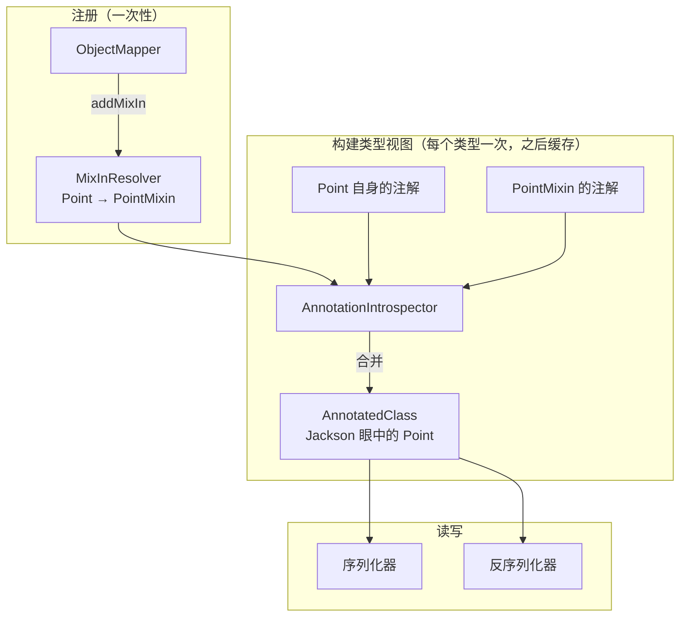
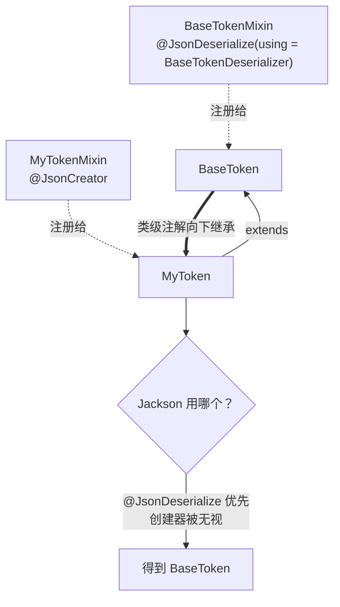
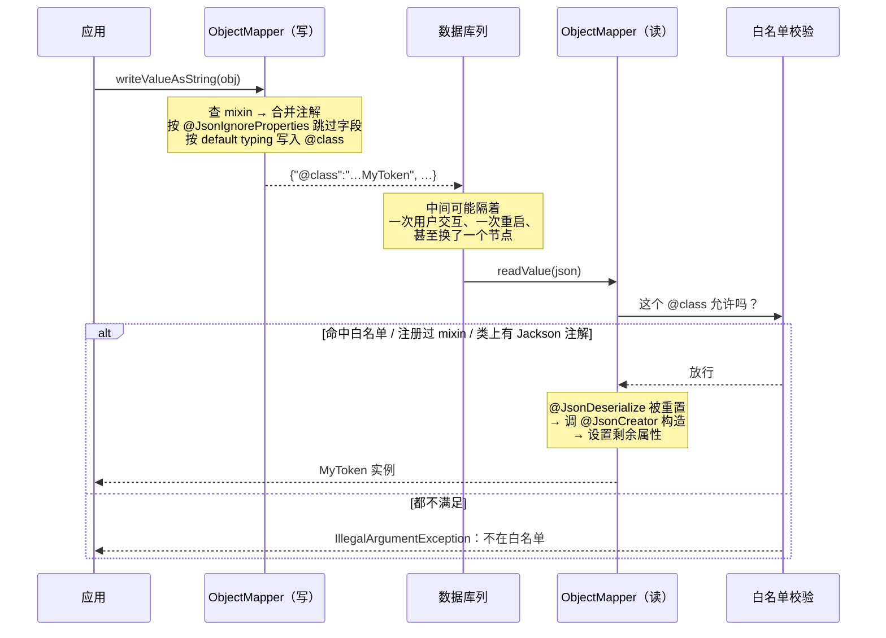

有一类需求长这样：你要把一个对象存成 JSON 写进数据库的某一列，过一会儿再原样读回来。对象的类型不在你手里——它来自框架、来自另一个团队、或者虽然是你写的但被全项目引用，不适合为了序列化去改它。

Jackson 对这件事的答案叫 **Mixin**：把注解写在另一个类上，让 Jackson 读注解时以为它们写在目标类上。

这篇是这条路上的技术笔记。它比"加个注解就好了"要曲折一些，主要曲折在三个地方：类型信息、安全白名单，以及注解的继承合并。

## 一、问题的形状

先把问题说清楚，因为后面所有复杂度都是从它长出来的。

假设有这么一个字段要持久化：

```kotlin
val attributes: Map<String, Any>
```

`Any` 意味着运行时可以是任何东西。序列化没问题，Jackson 会照着实际对象写出字段。麻烦在读回来的时候：JSON 里只有

```json
{ "principal": { "username": "alice", "tenantId": 7 } }
```

Jackson 看到的静态类型是 `Any`，它不知道该构造哪个类。这不是 Jackson 的缺陷，是 JSON 本身不携带类型信息。

## 二、第一层：默认类型信息

Jackson 的解法是把类型名一起写进去，叫 **default typing**：

```kotlin
val mapper = ObjectMapper()
mapper.activateDefaultTyping(
    mapper.polymorphicTypeValidator,
    ObjectMapper.DefaultTyping.NON_FINAL,
    JsonTypeInfo.As.PROPERTY,
)
```

开启后，输出多出一个 `@class`：

```json
{
  "@class": "com.example.TenantPrincipal",
  "username": "alice",
  "tenantId": 7
}
```

读的时候 Jackson 拿这个字符串去 `Class.forName`，就知道该构造谁了。

`NON_FINAL` 的意思是"给所有非 final 的类型都加"。为什么是它？因为一个 `final` 类的静态类型已经确定了实现，不存在歧义；而任何可继承的类型都可能在运行时是别的东西。

## 三、第二层：`@class` 是个安全洞

`Class.forName` + 反射构造，意味着**JSON 文档能指挥 JVM 加载并实例化任意类**。这是反序列化漏洞的经典形状：攻击者不需要能执行代码，只需要能让你实例化 classpath 上某个"在构造或 setter 里做危险事情"的类——这类类叫 gadget，把它们串起来叫 gadget chain。

所以凡是开了 default typing 的框架都会配一道闸。Spring Security 的做法是白名单，逻辑在 `SecurityJackson2Modules.AllowlistTypeIdResolver` 里，简化后是这样：

```java
JavaType result = delegate.typeFromId(context, id);
Class<?> raw = result.getRawClass();

if (isInAllowlist(raw.getName())) return result;                          // ① 硬编码名单
if (config.findMixInClassFor(raw) != null) return result;                 // ② 注册过 mixin
if (findAnnotation(raw, JacksonAnnotation.class) != null) return result;  // ③ 类上有 Jackson 注解

throw new IllegalArgumentException("... is not in the allowlist ...");
```

三条里有两条值得单独强调。

**第一，这道检查只在反序列化时发生。** 写入不检查——写入只是把对象变成字符串，没有实例化任何东西。所以一个未注册的类型会**写入成功、读回失败**。如果写和读隔着一次用户交互（比如一个页面渲染、用户点了按钮才回来读），症状会非常具有迷惑性：前半程一切正常，最后一步炸。

**第二，规则②把"注册了 mixin"当成信任信号。** 这不是巧合：注册 mixin 是个显式的、只能由应用代码做出的动作，等于开发者签字说"这个类我认得，我知道它会被怎么构造"。所以在这类框架里，mixin 同时承担两个职责——**告诉 Jackson 怎么映射**，以及**告诉安全层这个类型可信**。

## 四、Mixin：注解的外挂

先看最小的形态，不涉及任何框架：

```kotlin
// 第三方库里的类，你改不了
class Point(val x: Int, val y: Int)

// 你自己写的 mixin，只有注解，没有实现
abstract class PointMixin @JsonCreator constructor(
    @JsonProperty("x") x: Int,
    @JsonProperty("y") y: Int,
)

val mapper = ObjectMapper().addMixIn(Point::class.java, PointMixin::class.java)
```

`PointMixin` 永远不会被实例化，它的构造函数体是空的、也从不执行。它唯一的作用是**携带注解**。

### 类之间是什么关系

关键在于：mixin 和目标类之间**没有任何 Java 层面的关系**。不是继承，不是实现，不是包装，运行时也不产生代理。它们的唯一联系是 `ObjectMapper` 里的一张映射表。



Jackson 在第一次处理某个类型时，会构建一个 `AnnotatedClass`——可以理解成"Jackson 眼中的这个类长什么样"。构建过程中 `AnnotationIntrospector` 会去 `MixInResolver` 问一句"这个类有 mixin 吗"，有的话就把 mixin 上的注解**合并进来，并且优先级更高**。

之后所有的序列化/反序列化决策都基于这份合并后的视图，目标类的字节码一个字节都没变。

### 成员是怎么对上的

类级注解直接合并。成员级注解需要匹配，规则是：

| 成员 | 匹配依据 |
|---|---|
| 字段 | 名称 |
| 方法 | 名称 + 参数类型 |
| 构造函数 | 参数类型列表 |

所以 mixin 里写 `@JsonProperty("x") x: Int` 是在给"目标类那个叫 x 的构造参数"打注解。**参数类型必须完全一致**，否则匹配不上——而且不会报错，只是注解静悄悄地不生效。这是 mixin 最常见的哑火方式。

### 能打哪些注解

任何 Jackson 注解，常用的三类：

```kotlin
@JsonIgnoreProperties(value = ["secret", "cachedView"], ignoreUnknown = true)
abstract class ThingMixin @JsonCreator constructor(
    @JsonProperty("id") id: Long,
    @JsonProperty("name") name: String,
) {
    @JsonIgnore
    abstract fun getExpensiveDerivedValue(): String
}
```

- `@JsonCreator` + `@JsonProperty`：指定用哪个构造函数重建，以及参数怎么对应
- `@JsonIgnoreProperties(value = ...)`：**双向**排除，写不出去也读不进来
- `ignoreUnknown = true`：只影响读，遇到不认识的字段不报错——这一项让格式演进和旧数据兼容成为可能

## 五、坑一：注解会沿继承链合并

这是最容易踩、也最难查的一个。

假设你的类继承自框架的某个类，而框架给**父类**注册了一个 mixin，那个 mixin 上写着自定义反序列化器：

```java
// 框架内部
@JsonDeserialize(using = BaseTokenDeserializer.class)
abstract class BaseTokenMixin {}

mapper.addMixIn(BaseToken.class, BaseTokenMixin.class);
```

你为自己的子类注册了 mixin，写了 `@JsonCreator`，一切看起来都对：

```kotlin
abstract class MyTokenMixin @JsonCreator constructor(
    @JsonProperty("principal") principal: Any,
    @JsonProperty("tenantId") tenantId: Long,
)
```

然后你会发现：**反序列化回来的对象是 `BaseToken`，不是 `MyToken`**，而且你的 `@JsonCreator` 从头到尾没被调用过。

原因是 Jackson 构建 `AnnotatedClass` 时会**沿继承链向上收集类级注解，父类的 mixin 也在收集范围内**。父类 mixin 上的 `@JsonDeserialize(using = ...)` 就这样落到了你的子类头上。而自定义反序列化器通常是手写 `deserialize()`、自己 `new` 出对象的——它 `new` 的是它自己那个类，压根不看你的构造函数。



### 怎么解

用 Jackson 的重置哨兵，显式声明"这个类型没有自定义反序列化器"：

```kotlin
@JsonDeserialize(using = JsonDeserializer.None::class)
abstract class MyTokenMixin @JsonCreator constructor(
    @JsonProperty("principal") principal: Any,
    @JsonProperty("tenantId") tenantId: Long,
)
```

`JsonDeserializer.None` 是一个专门用来"取消"的占位类型。子类 mixin 上的注解优先级高于继承来的，所以它能压住父类那条。对应的序列化侧是 `JsonSerializer.None`。

### 为什么这个坑特别贵

因为它**不抛异常**。你会拿到一个类型不对但看起来正常的对象，往下走若干层之后才在某个"字段怎么是空的"的地方失败。等你查到那里，离真正的原因已经隔了好几个环节。

排查这类问题的一个快捷判据：**如果 `@JsonCreator` 里打断点没停下来，就去继承链上找 `@JsonDeserialize`。**

## 六、坑二：创建器跑完之后，Jackson 还没结束

`@JsonCreator` 只负责构造。构造完之后，Jackson 会继续把 JSON 里**剩下的、创建器没消费掉的**属性设置到对象上——通过 setter 或直接写字段。

于是会出现这种事：某个属性有 setter，但那个 setter 是主动抛异常的。

```kotlin
// 框架里常见的写法：这个状态只能由构造函数确立
override fun setAuthenticated(authenticated: Boolean) {
    if (authenticated) {
        throw IllegalArgumentException(
            "Cannot set this token to trusted - use constructor which takes a GrantedAuthority list instead"
        )
    }
    super.setAuthenticated(false)
}
```

序列化时这个属性被正常写出去了（它有 getter），读回来时 Jackson 就去调那个 setter，然后炸。

解法是把它排除掉：

```kotlin
@JsonIgnoreProperties(value = ["authenticated"], ignoreUnknown = true)
```

排除之后它既不写出、也不读入，值完全由创建器确立。

这里有个容易忽略的细节：可见性配置常常只关了 getter。比如

```java
@JsonAutoDetect(
    fieldVisibility = ANY,
    getterVisibility = NONE,
    isGetterVisibility = NONE)
```

这份配置让序列化走字段而不是 getter，但它**没有关掉 setter**——反序列化侧照样会去找 setter。所以"我已经配了 `getterVisibility = NONE`，不会调方法"这个假设是错的。

## 七、坑三：ObjectMapper 往往不止一个

最后一个不是 Jackson 的问题，是集成时的问题，但代价很高。

框架内部经常为读和写各建一个 `ObjectMapper`。比如一个典型的 JDBC 存储层：

```
XxxRowMapper        (读) → 自己的 ObjectMapper
XxxParametersMapper (写) → 自己的 ObjectMapper
```

如果你只往其中一个上注册了 mixin，结果是两侧对格式的理解不一致——写出来的是排除过字段的精简形态，读的那侧却按完整形态去解析（或者反过来）。这类不一致通常表现为"某个字段莫名其妙是 null"。

**接入前先数清楚有几个 mapper。** 拿到它们的方式通常有两种：

```kotlin
// 一、有 setter：直接换一个自己配好的
rowMapper.setObjectMapper(myMapper)

// 二、只有 protected 的 getter：继承，在子类构造函数里改
private class MyRowMapper(repo: Repo) : XxxRowMapper(repo) {
    init { applyMixins(objectMapper) }
}
```

第二种更值得推荐。因为框架自己在构造函数里往那个 mapper 上注册了一堆模块（安全模块、领域模块……），**在它的基础上追加**比自己从零拼一个安全得多——你不会漏掉某个你根本不知道存在的模块。

## 八、完整的数据流

把上面几节串起来，一次完整往返：



值得注意的是中间那段"隔着"。**写和读之间的距离，决定了这类问题有多难查。** 如果是同一个方法里 write 完立刻 read，问题当场暴露；如果中间隔着一次用户交互，你看到的就是"前面都好好的，最后一步报了个看不懂的错"。

## 九、一份完整的最小示例

```kotlin
import com.fasterxml.jackson.annotation.*
import com.fasterxml.jackson.databind.*
import com.fasterxml.jackson.databind.annotation.JsonDeserialize

// ── 目标类：不能改，或者不想为了序列化去改 ──────────────────────
open class BaseToken(val principal: Any) {
    var authenticated: Boolean = false
        set(value) {
            require(!value) { "只能由构造函数确立" }
            field = value
        }
}

class MyToken(
    principal: Any,
    val tenantId: Long,
    val secret: String?,          // 不该落库
) : BaseToken(principal) {
    init { /* … */ }
}

// ── Mixin：只有注解 ──────────────────────────────────────────
@JsonDeserialize(using = JsonDeserializer.None::class)   // 压住继承来的反序列化器
@JsonIgnoreProperties(
    value = ["authenticated", "secret"],                 // 双向排除
    ignoreUnknown = true,                                // 容忍旧数据与新增字段
)
abstract class MyTokenMixin @JsonCreator constructor(
    @JsonProperty("principal") principal: Any,
    @JsonProperty("tenantId") tenantId: Long,
    @JsonProperty("secret") secret: String?,             // 参数类型必须与目标构造函数一致
)

// ── 注册 ────────────────────────────────────────────────────
fun ObjectMapper.applyMixins(): ObjectMapper = apply {
    addMixIn(MyToken::class.java, MyTokenMixin::class.java)
}
```

`@JsonCreator` 的参数列表必须能匹配上 `MyToken` 的某个构造函数——包括那些被 `@JsonIgnoreProperties` 排除掉的参数。**排除的是"哪些属性参与 JSON"，不是"构造函数长什么样"**；被排除的参数在反序列化时拿到 null 或默认值。如果这不可接受，就给目标类加一个专供重建用的构造函数。

顺带说一句：如果重建路径需要一个"轻量构造函数"，值得认真考虑加一个。很多类的构造函数里会做初始化工作——查库、算派生字段、访问上下文——那些在正常创建时是对的，在"从数据库回读一个快照"时既没必要也可能直接失败（依赖的东西还没建好）。

## 十、检查清单

落地时按这个顺序走一遍，能省掉大部分往返：

1. **数清楚有几个 ObjectMapper。** 读写常常是两个，都要装。
2. **优先继承并追加，而不是自建 mapper。** 框架注册的模块你不一定知道全。
3. **检查继承链上有没有 `@JsonDeserialize`。** 有就用 `JsonDeserializer.None` 重置。
4. **检查有没有会抛异常的 setter。** 创建器跑完之后 Jackson 还会设置剩余属性。
5. **确认创建器的参数类型与目标构造函数完全一致。** 不一致不报错，只是不生效。
6. **默认加上 `ignoreUnknown = true`。** 这是格式演进的唯一退路。
7. **写一个往返测试。** 用与生产完全相同的方式拼那个 mapper。

最后一条最要紧。这一整套东西的失败模式高度一致：**编译通过、启动正常、运行时才炸，而且炸的位置离原因很远。** 一个 20 行的往返测试能把它们全部前移到构建阶段——本文里的两个坑就是这么被抓出来的，代价是一次测试运行，而不是一次部署加一轮排查。
