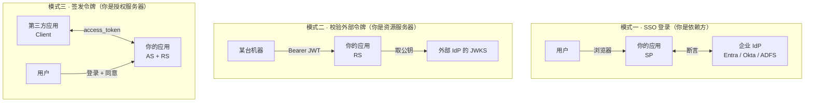
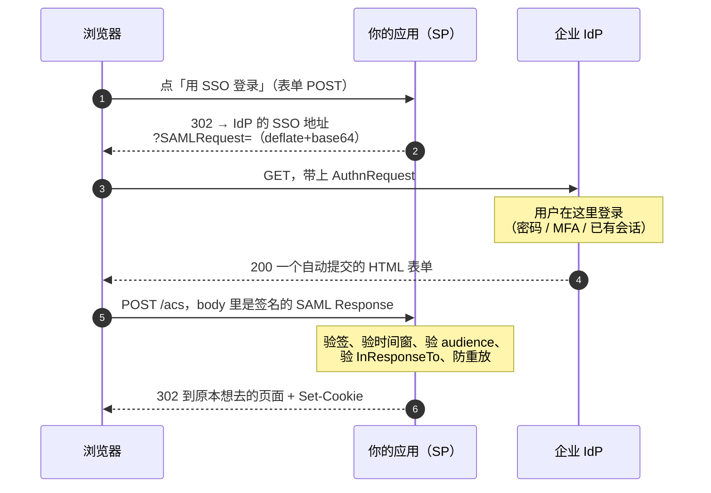
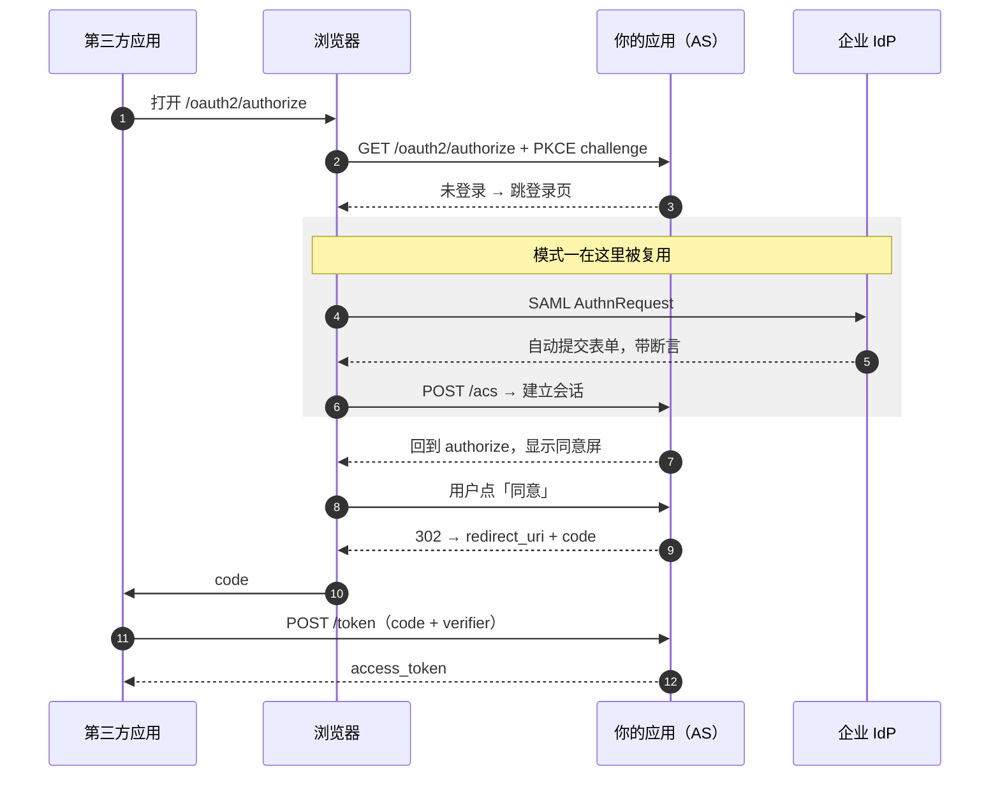
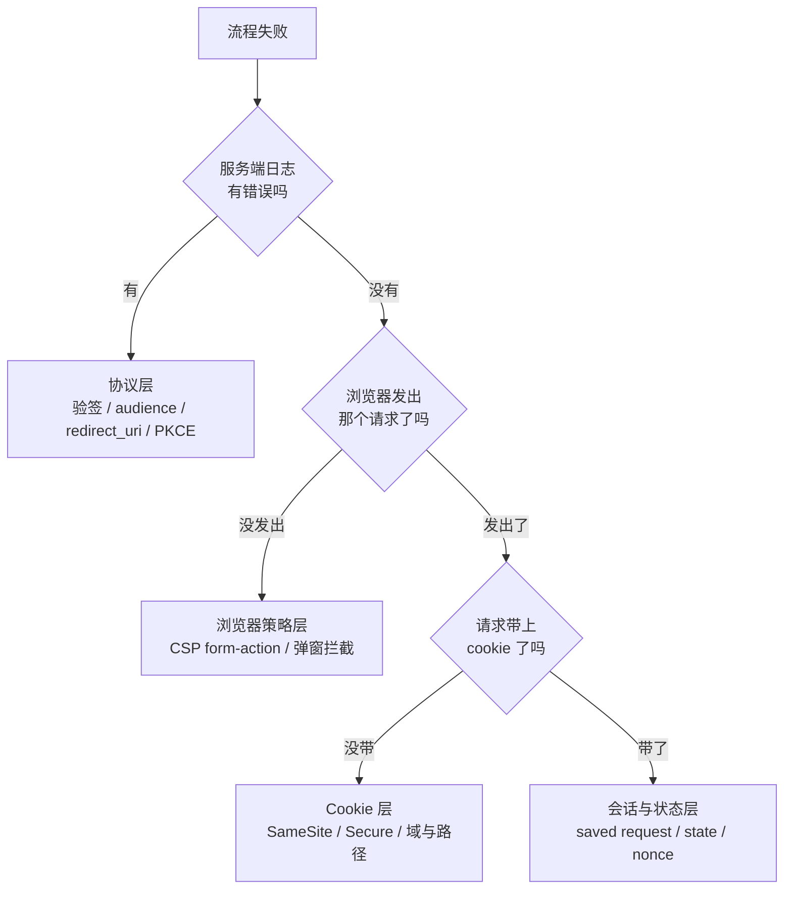

有三类技术总是被混着讲：**SSO 登录**、**发令牌给第三方应用**、**校验别人签发的令牌**。它们都会把浏览器重定向到另一个域，都涉及签名的凭据，都被人随口叫作「OAuth」或者「单点登录」。

混淆的代价不是学术性的。它会让你在设计阶段问出「我们已经有 SSO 了，还需要做授权服务器吗」这种问题——而这个问题的答案取决于你把哪个角色放在了箭头的哪一端。

这篇不讲任何一个协议的完整规范，只做一件事：**把角色和方向理清楚**，然后解释为什么在这三者之上还有第四个参与者——浏览器——能让协议层完全正确的流程整个失败。

---

## 第一刀：认证不是授权

两个词长得像，回答的是完全不同的问题。

| | 回答的问题 | 典型产物 | 谁关心 |
|---|---|---|---|
| **认证** AuthN | 你是谁？ | 一次会话，或一个身份凭据 | 你的应用 |
| **授权** AuthZ | 这个应用可以代表你做什么？ | 一个带 scope 的访问令牌 | 第三方应用 |

「用 Google 登录」是认证。「允许某个日历应用读你的 Google 日历」是授权。两者可以在同一次跳转里完成（OIDC 就是这么设计的），但它们是可分离的两件事。

有一个判断句很好用：

> 如果流程结束时，**只有你的服务器**需要知道结果（建一个会话），那是认证。
> 如果流程结束时，**另一个程序**要拿走点东西反复使用，那是授权。

---

## 第二刀：看箭头的方向

角色名字容易记混，但方向不会骗人。**看凭据是谁签的、谁拿去花。**



三张图里你的应用分别是：**消费签名的一方**、**消费签名的一方**、**产生签名的一方**。前两个模式再怎么做，也长不出第三个模式的能力——这是最常见的误判。

一张对照表：

| | 模式一 SAML SSO | 模式二 校验外部 JWT | 模式三 授权服务器 |
|---|---|---|---|
| 你的角色 | SP / 依赖方 | Resource Server | Authorization Server |
| 谁签名 | 外部 IdP | 外部 IdP | **你自己** |
| 凭据形态 | SAML 断言（XML） | JWT | access token（JWT 或不透明） |
| 凭据寿命 | 几分钟，用一次 | 几分钟到几小时，可重放 | 分钟到小时，可 refresh |
| 谁持有并使用 | 浏览器（转交一次） | 调用方进程 | 第三方应用进程 |
| 需要浏览器吗 | **必须** | 不需要 | 换令牌时需要，之后不需要 |
| 结果 | 一个会话 cookie | 一次通过的 API 调用 | 一个可反复使用的令牌 |
| 主体粒度 | 每个真人一个身份 | 通常固定映射到一个账号 | 每个真人 × 每个应用 |

最后一行值得停一下。模式二在实现上几乎总是「某个外部 issuer 的令牌 → 映射到我这边某个固定服务账号」，因为 JWT 里的 `sub` 是对方系统的用户 ID，你没有可靠办法把它翻译成你这边的真人。**这让模式二在语义上是 API key 的变体，不是 SSO，也不是委托授权。**

---

## SAML：把「你是谁」外包出去

SAML 2.0 是 2005 年的规范，XML，签名用 XML-Signature。它解决的问题很窄也很清楚：**让用户不必在你这里再输一次密码**。

### SP-initiated 流程



两个 binding 值得注意，它们后面会咬人：

- **第 2 步用 HTTP-Redirect binding**：请求塞进 query string，一个 302。
- **第 5 步用 HTTP-POST binding**：IdP 返回一个 `<form method="post" action="你的ACS">` 加一段 `onload` 自动提交的脚本。之所以不用 302，是因为断言体积大（XML + 签名，动辄几 KB），而且放进 URL 会泄露到 Referer 和访问日志里。

### 断言的四个性质

一份 SAML 断言不是令牌，把它当令牌理解会推出一堆错误结论：

1. **一次性。** `SubjectConfirmationData` 带 `Recipient` 和 `InResponseTo`，SP 应当记录已用过的断言 ID 来防重放。
2. **窗口极窄。** `<Conditions NotBefore / NotOnOrAfter>` 通常是几分钟——只够完成这一次跳转。
3. **绑定单一受众。** `<AudienceRestriction>` 写死了目标 SP 的 entityID。拿给别的服务用会被拒。
4. **没有续期概念。** 没有 refresh，没有 introspection。用完之后，会话完全靠 SP 自己的 cookie 维持——**断言不再参与任何后续请求**。

第 4 点是关键：**SAML 流程结束的那一刻，那份签名的凭据就死了。** 所以任何「让某个后台进程持续调用 API」的需求，SAML 天然给不了答案。

### 边界

SAML 的每一步都需要一个人和一个浏览器：需要有人能看到 IdP 的登录页，需要浏览器执行自动提交的表单，需要 cookie 来承载结果。一个服务器端进程无法「走一遍 SAML」——没有它可以驱动的 UI，也没有它可以持有的长期凭据。

---

## OAuth：把「能代表你做什么」授权出去

OAuth 解决的是另一个问题：**用户想让一个第三方应用代表自己访问某个 API，但不愿意把密码交出去。**

四个角色：Resource Owner（用户）、Client（第三方应用）、Authorization Server（签发令牌）、Resource Server（验令牌、提供 API）。授权码流程和 PKCE 的落地细节在 [签发令牌的那一端](./signing-tokens-oauth-authorization-server.md) 里写过，这里只放和 SAML 的对照：

| | SAML 断言 | OAuth access token |
|---|---|---|
| 谁持有 | 浏览器，转交一次即弃 | 客户端进程，长期保存 |
| 能重放吗 | 不能（应被拒） | **能，这正是它的用途** |
| 寿命 | 分钟级 | 分钟到小时，可 refresh |
| 能撤销吗 | 无此概念 | 能（不透明令牌立刻生效） |
| 携带的信息 | 这个人是谁 | 这个客户端代表这个人，能做哪些 scope |
| 传输方式 | 表单 POST body | `Authorization: Bearer` 头 |

一句话概括差别：**断言是一张一次性的入场券，令牌是一张有有效期的会员卡。**

### 顺带说清 OIDC

OpenID Connect 常被当成第四种东西，其实它就是**用 OAuth 的机器做 SAML 的活**：在授权码流程之上多返回一个 `id_token`（一个 JWT），专门回答「这个人是谁」。

所以真正的对应关系是：

```
SAML  ≈  OIDC          （都在做认证，只是编码和传输不同：XML/表单 POST  vs  JWT/JSON）
SAML  ≠  OAuth         （一个做认证，一个做授权，不可互换）
```

如果你已经在用 SAML 做 SSO，又要做授权服务器，**这不是重复建设**——它们各自回答的问题不重叠。

---

## 第三种模式：校验别人签的 JWT

这是最容易被误认为「我们已经支持 OAuth 了」的那一个。做法很短：

```
1. 从 Authorization: Bearer 里取出 JWT
2. 解 header 拿 kid
3. 去 issuer 的 JWKS 端点按 kid 取公钥（缓存起来）
4. 验签名
5. 验 iss 等于你配置的 issuer
6. 验 aud 包含你自己
7. 验 exp / nbf
8. 把 sub 映射成你系统里的某个账号
```

第 8 步是它的天花板。JWT 里的 `sub` 是**签发方**的用户标识，你没有可靠办法把它变成你这边的真人身份——除非你和对方共享一个用户目录。所以现实中这一步几乎总是退化成「整个 issuer 映射到一个固定服务账号」。

这带来三个必须认清的后果：

- **它不是 SSO。** 没有浏览器参与，没有登录界面，没有会话。
- **它不能替代授权服务器。** 它要求存在一个愿意为你签发正确 `aud` 的外部 IdP。第三方 SaaS（比如某个 AI 助手平台）是**客户端**，不是 IdP——它不会为你签任何东西。
- **它的审计粒度是「哪台机器」，不是「哪个人」。**

---

## 三者可以串联

这是最容易被忽略的一点：它们不是三选一，可以接成一条链。



**SAML 负责「这个人是谁」，OAuth 负责「这个应用可以代表他做什么」。** 认证的结果（会话）成为授权流程的输入。这也是为什么两套东西都要建，而不是二选一。

---

## 浏览器这一票

前面所有内容都在协议层。但这三种流程有一个共同的物理特征：

> **在浏览器里，从一个域跳到另一个域。**

而浏览器对「跳到哪里」有自己的一套否决权，跟你实现了什么协议毫无关系。这一层最难排查，因为**服务端日志里什么都是对的**。

### CSP 是什么

Content Security Policy 是一个 HTTP 响应头，声明「**这个文档**被允许做哪些事」。它按文档生效——决定权在**发起动作的那个页面**的策略，不在目标页面。

```
Content-Security-Policy: default-src 'none'; script-src 'self'; form-action 'self'
```

有三个指令**不受 `default-src` 兜底**，必须单独写，也最容易被忘掉：

| 指令 | 管什么 |
|---|---|
| `form-action` | 表单可以提交到哪些源 |
| `frame-ancestors` | 谁可以把你嵌进 iframe |
| `base-uri` | `<base href>` 可以指向哪里 |

### `form-action` 的真正语义

绝大多数人以为 `form-action` 只检查 `<form action="...">` 里写的那个地址。**它检查的是这次表单提交引发的整条导航链。**

```
页面 A（form-action 'self'）
  └─ POST /login              ← 同源，通过
       └─ 302 /authorize      ← 同源，通过
            └─ 302 https://外部域/callback   ← 拦截，整条导航中止
```

这会产生一个**极具误导性**的症状组合：

- 服务端一切正常，302 发出去了，会话建好了，日志里没有任何错误
- 浏览器停在空白页
- Console 里的报错指向的是**同源的那个初始地址**，看起来像「`'self'` 拒绝了 self」

最后一条不是浏览器的 bug，是规范要求的：重定向被拦时，上报的 `blockedURI` 是**重定向之前**的 URL，以免把跨域跳转目标泄露回页面。所以**报错里的地址永远不是真正被拦的那个**。

还有一个跨浏览器差异值得记住：**Chromium 系（Chrome / Edge）会逐跳校验重定向链，Firefox 历史上不校验。** 也就是说同一个缺陷可能「在 Firefox 上是好的」——这会让排查过程更加错乱。

### 哪些流程会撞上它

| 流程 | 表单提交后跳向 | `form-action` 需要包含 |
|---|---|---|
| SAML SP-initiated 登录 | 企业 IdP 的域 | IdP 的源 |
| OAuth 授权码（先登录再继续） | 客户端的 `redirect_uri` | 客户端回调的源 |
| 任何「登录后跳回外部来源」 | 外部来源 | 那个源 |

规律很清楚：**只要「表单提交」和「跳到外部域」同时出现，就会撞上。** 而 SSO 和授权码流程恰好都同时满足这两条。

如果放宽 CSP 不可接受，还有一条出路：把最后一跳改成**非表单发起**的导航——渲染一个中间页，用 `<a>` 或 `location.assign()` 顶层跳转。`form-action` 只作用于表单提交及其重定向链，普通导航不受它约束。

### 不止 CSP：其他会咬人的浏览器策略

| 策略 | 典型症状 | 为什么 |
|---|---|---|
| `SameSite=Lax` cookie | SAML 回调后「像是没登录」 | IdP 用 **POST** 把断言送回来，跨站 POST 在 Lax 下不带 cookie（`Lax` 只放行跨站 **GET** 顶层导航）。需要 `SameSite=None; Secure` |
| 第三方 cookie 限制 | 静默续期、iframe 里的会话失效 | 浏览器逐步默认拦截跨站 cookie |
| `Referrer-Policy` | 服务端拿不到来源判断 | 默认策略会裁剪甚至清空 Referer |
| `frame-ancestors` / `X-Frame-Options` | 嵌入式登录白屏 | 登录页拒绝被嵌 |
| COOP / 弹窗拦截 | 弹窗式授权拿不到结果 | `window.opener` 被切断 |

`SameSite` 那一条尤其值得记：它和 `form-action` 是同一类问题的两个面——**协议规定用跨站表单 POST 回传，而浏览器的默认安全策略正在收紧跨站表单 POST。**

---

## 命名陷阱

大部分混乱其实来自命名。几个高频的：

| 词 | 至少两种意思 |
|---|---|
| **OAuth Client** | ①「我们作为客户端去接别人的 OAuth」 ②「登记在我们这里、可以来要令牌的第三方」——**方向相反** |
| **Token** | SAML 圈里指断言；OAuth 圈里指 access token；有些产品里指 API key |
| **IdP** | 严格指 SAML/OIDC 的身份提供方；口语里常被拿来泛指「任何签发凭据的东西」，于是把 AS 也叫成 IdP |
| **SSO** | 有时指 SAML/OIDC 登录；有时泛指「不用再输密码」 |
| **Provider** | 可能是 issuer，可能是 Spring 的 `AuthenticationProvider`，两者毫无关系 |

一个实用建议：**在代码和界面里永远不要单用「OAuth Client」这个词。** 用「外部身份提供方」和「第三方连接器」这类带方向的说法。命名上省下的那点字，会在半年后以排查成本还回来。

---

## 症状 → 该看哪一层



配套的排查习惯：

1. **DevTools 勾上 Preserve log**。整条链每一跳都是一次导航，不勾会全部丢掉。
2. **先看 Console 有没有 CSP 违规**，再去看 Network。协议层的问题会有响应体，浏览器层的问题只有 Console 一行。
3. **别信 CSP 报错里的 URL**（见上文）。看的是「哪条指令」，不是「哪个地址」。
4. **服务端全绿 + 浏览器停住 = 几乎一定在浏览器策略层。**

---

## 一页速查

```
认证 = 你是谁              授权 = 这个应用能代表你做什么

模式一 SAML SSO      外部签 → 你验 → 建会话      必须有浏览器和人
模式二 校验外部 JWT   外部签 → 你验 → 放行调用    机器对机器，粒度到「哪台机器」
模式三 授权服务器     你签  → 别人花             唯一能让第三方长期代表用户的方式

断言 = 一次性入场券（分钟级、绑受众、不可重放）
令牌 = 有期限的会员卡（可重放、可续期、可撤销）

CSP form-action 检查整条重定向链
  · 不受 default-src 兜底
  · 报错里的 URL 是重定向之前的那个
  · Chromium 校验重定向，Firefox 历史上不校验
SameSite=Lax 会拦掉跨站表单 POST 带 cookie —— SAML 回调正是跨站 POST
```

---

## 规范索引

| 规范 | 内容 |
|---|---|
| SAML 2.0 Core / Bindings | 断言结构、HTTP-Redirect 与 HTTP-POST binding |
| RFC 6749 / 6750 | OAuth 2.0 框架与 Bearer 令牌 |
| RFC 7636 | PKCE |
| RFC 7517 / 7519 | JWK（JWKS）与 JWT |
| RFC 8414 | 授权服务器元数据 |
| RFC 9728 | 受保护资源元数据 |
| OpenID Connect Core | 在 OAuth 之上的身份层 |
| CSP Level 3 | `form-action`、`frame-ancestors`、`base-uri`，以及重定向时的上报规则 |
| RFC 6265bis | SameSite cookie 语义 |
