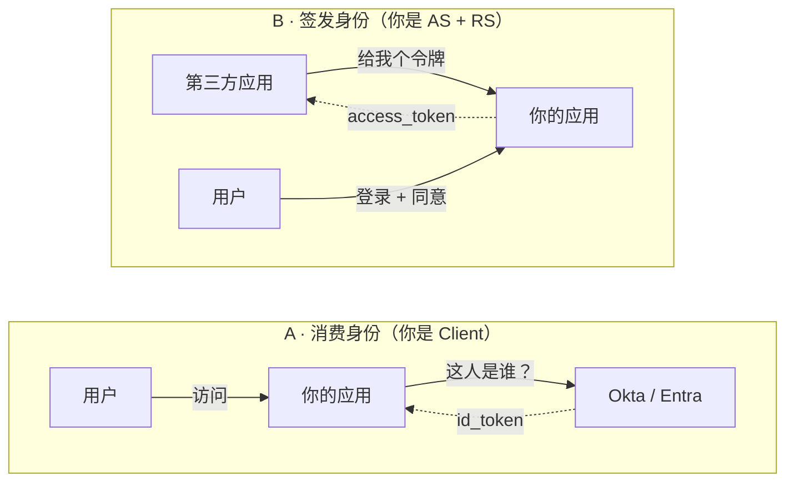
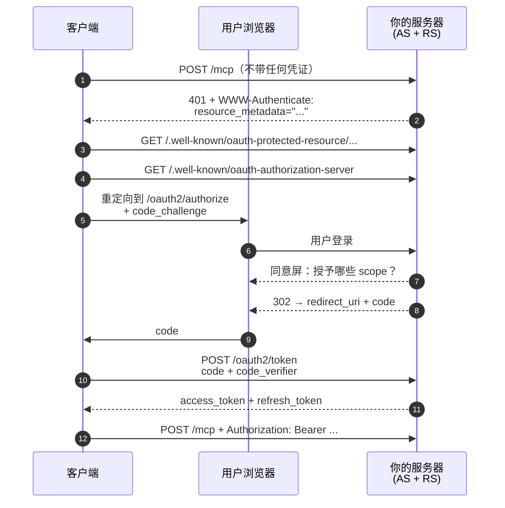
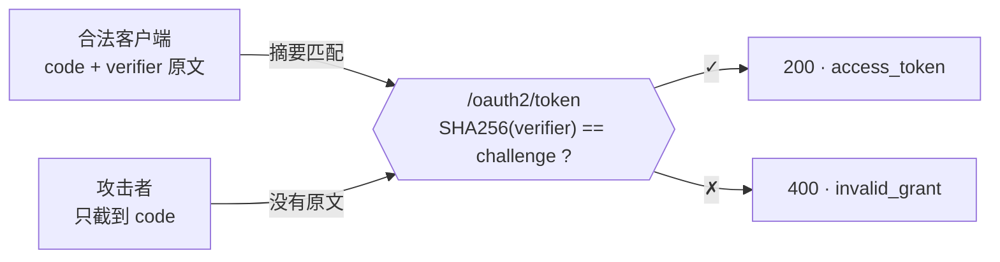

绝大多数应用只做 OAuth 的消费方——"用 Google 登录"。但当你要让一个你从未见过的第三方应用代表用户来调你的 API 时，你得站到协议的另一端去：自己签发令牌。这是那一端的技术笔记。

## 两个方向

OAuth 里只有三个角色：**Authorization Server**（AS，签发令牌）、**Resource Server**（RS，验令牌、提供 API）、**Client**（想访问 API 的应用）。一个系统可以同时扮演多个角色，所以"我现在是哪个角色"这个问题需要一个判据。

判据只有一条：**看令牌是谁签发的、谁在花它。**



情形 A 里令牌由外部签发，你负责验证它。情形 B 里令牌由你签发，别人拿去花——所以你得先认识用户。

箭头掉了个头。这个方向差异是最容易踩的坑：团队里已经有"支持客户用 Okta 登录"的能力，很自然会觉得"OAuth 我们已经做了"。但那是情形 A。情形 B 的代码量、数据模型和安全责任，和情形 A 几乎不重叠。

## 握手的九步

下面是一个第三方应用（比如一个 AI 助手客户端）第一次接入你的 API 时，完整发生的事。它是 **authorization code flow** 加上 **MCP 的发现链**——如果你做的不是 MCP，第 1–4 步会由人工配置替代，第 5–9 步完全一样。



注意第 6 步：**用户身份是在你自己的登录页上产生的**。客户端从头到尾没有告诉过你用户是谁，也不需要被信任。

整条链里，客户端拿到的只是一个不透明字符串。它不知道背后是谁，也无法伪造成另一个人——因为它从来没有参与过身份的产生过程。这就是为什么你不需要和第三方"约定用邮箱对应用户"：那既不安全，协议里也没有那个字段。

## 为什么必须有 PKCE

第 8 步里，授权码是通过**浏览器重定向**传回客户端的。重定向 URL 会出现在浏览器历史、系统日志、Referer 头里，在移动端还可能被注册了同一个 custom scheme 的恶意应用截获。如果换令牌只需要授权码，那么谁截到码谁就能拿到令牌。

**PKCE**（Proof Key for Code Exchange，RFC 7636）解决这个问题的方式很朴素：让客户端在发起授权之前先生成一个随机串（`code_verifier`），把它的 SHA-256 摘要（`code_challenge`）随授权请求发出去；换令牌时才出示原文。AS 重新计算摘要并比对。



授权码本身不再是凭证——它只是"持有某个原文的人"的提货单。截获授权码变得没有意义，因为原文从未离开过合法客户端的内存。

在 OAuth 2.1 里 PKCE 对**所有**客户端强制（2.0 时代只要求公开客户端）。`code_challenge_method` 只应接受 `S256`；规范里另有一个 `plain`（直接传原文），那等于没做，不要支持。

```javascript
const base64url = (bytes) =>
  btoa(String.fromCharCode(...bytes))
    .replace(/\+/g, '-').replace(/\//g, '_').replace(/=+$/, '');

// 1. code_verifier：43–128 字符的高熵随机串
const verifier = base64url(crypto.getRandomValues(new Uint8Array(32)));

// 2. code_challenge = BASE64URL(SHA-256(verifier))
const digest = await crypto.subtle.digest(
  'SHA-256', new TextEncoder().encode(verifier)
);
const challenge = base64url(new Uint8Array(digest));

// 3. 原文留在本地，只把摘要发出去
sessionStorage.setItem('pkce_verifier', verifier);

location.assign('https://as.example.com/oauth2/authorize?' +
  new URLSearchParams({
    response_type: 'code',
    client_id: CLIENT_ID,
    redirect_uri: REDIRECT_URI,
    scope: 'mcp:read',
    state: base64url(crypto.getRandomValues(new Uint8Array(16))),
    code_challenge: challenge,
    code_challenge_method: 'S256',
  }));
```

回调页拿原文换令牌：

```javascript
const code = new URLSearchParams(location.search).get('code');

const res = await fetch('https://as.example.com/oauth2/token', {
  method: 'POST',
  // 注意：令牌端点是 form-urlencoded，不是 JSON
  headers: { 'Content-Type': 'application/x-www-form-urlencoded' },
  body: new URLSearchParams({
    grant_type: 'authorization_code',
    code,
    redirect_uri: REDIRECT_URI,
    client_id: CLIENT_ID,
    code_verifier: sessionStorage.getItem('pkce_verifier'),
  }),
});

const { access_token, refresh_token, expires_in } = await res.json();
```

> **陷阱**：令牌端点必须接受 `application/x-www-form-urlencoded`。不少现代框架默认只解析 JSON 请求体，结果对一个完全合法的令牌请求返回 415，而客户端只会告诉你"授权失败"。这是自建 AS 最常见的首次联调失败原因。

## 发现链：客户端怎么知道去哪

传统 OAuth 里，客户端开发者是人工去读文档、把授权端点抄进配置的。MCP 场景下客户端要能**自动**发现——用户只填了一个 API 地址，剩下的必须靠协议问出来。这就是第 1–4 步的意义。

```bash
# 1. 裸敲受保护资源，看它怎么拒绝你
$ curl -i -X POST https://api.example.com/v1/mcp

HTTP/1.1 401 Unauthorized
WWW-Authenticate: Bearer resource_metadata=
  "https://api.example.com/.well-known/oauth-protected-resource/v1/mcp"

# 2. 顺着头去拿资源元数据（RFC 9728）
$ curl https://api.example.com/.well-known/oauth-protected-resource/v1/mcp
{
  "resource": "https://api.example.com/v1/mcp",
  "authorization_servers": ["https://api.example.com"],
  "scopes_supported": ["mcp:read"],
  "bearer_methods_supported": ["header"]
}

# 3. 再去拿授权服务器元数据（RFC 8414）
$ curl https://api.example.com/.well-known/oauth-authorization-server
{
  "issuer": "https://api.example.com",
  "authorization_endpoint": "https://api.example.com/oauth2/authorize",
  "token_endpoint": "https://api.example.com/oauth2/token",
  "grant_types_supported": ["authorization_code", "refresh_token"],
  "code_challenge_methods_supported": ["S256"]
}
```

三份文档，三个职责：**401 的头**说"往哪看"，**RFC 9728** 说"这个资源归哪个 AS 管"，**RFC 8414** 说"那个 AS 的端点和能力"。少任何一环，自动发现都会断在那里。

### 401 challenge

```kotlin
class BearerChallengeEntryPoint(
    private val metadataUrl: String,
) : AuthenticationEntryPoint {

    override fun commence(
        request: HttpServletRequest,
        response: HttpServletResponse,
        authException: AuthenticationException,
    ) {
        response.setHeader(
            HttpHeaders.WWW_AUTHENTICATE,
            """Bearer resource_metadata="$metadataUrl"""",
        )
        response.status = HttpServletResponse.SC_UNAUTHORIZED
        response.contentType = MediaType.APPLICATION_JSON_VALUE
        response.writer.write("""{"error":"unauthorized"}""")
    }
}
```

> **陷阱**：如果你的应用是个有 Web UI 的单体，它多半有一个全局的 entry point，把未认证请求 **302 重定向到登录页**。对浏览器这是对的，对 API 客户端这是灾难——它拿到一个 HTML 页面，完全不知道发生了什么。解法不是改全局 entry point（那会影响整个 UI），而是给 API 路径单独挂一条 `securityMatcher` 更窄、`@Order` 更靠前的过滤器链。

### 资源元数据端点

```kotlin
@RestController
class ProtectedResourceMetadataController(
    @Value("\${app.issuer}") private val issuer: String,
) {
    // well-known 路径把被保护资源的 path 拼在后面
    // /.well-known/oauth-protected-resource/v1/mcp  →  path = "/v1/mcp"
    @GetMapping("/.well-known/oauth-protected-resource/{*path}")
    fun metadata(@PathVariable path: String): Map<String, Any> = mapOf(
        "resource" to "$issuer$path",
        "authorization_servers" to listOf(issuer),
        "scopes_supported" to listOf("mcp:read"),
        "bearer_methods_supported" to listOf("header"),
    )
}
```

> **陷阱**：`resource` 的值必须和被保护 URL **逐字符相同**——多一个尾斜杠、少一段路径前缀、http 写成 https，客户端都会判定不匹配并中止。这个字段是防"混淆代理"攻击的锚点，所以校验是严格的，不做归一化。

## 客户端从哪来

AS 只给**登记过的**客户端发令牌——否则任何人都能构造一个授权请求，骗用户把权限授予自己。所以在第 5 步之前，客户端必须先有一个 `client_id`。拿到它有三条路：

| 方式 | 机制 | 代价 |
|---|---|---|
| 手工登记 | 管理员在后台建一条记录，把 client_id / secret 交给对方填进配置 | 零开发量；每接一个客户端都要人工介入 |
| DCR（RFC 7591） | 客户端 POST 到 `registration_endpoint`，AS 当场分配 client_id | 要实现注册端点、防滥用策略、客户端清理 |
| CIMD | client_id 本身就是一个 https URL，AS 去抓那个 URL 上的客户端描述文档 | 无需存储客户端；但 AS 要做出站抓取，且规范较新 |

要在元数据里声明你支持哪种。DCR 声明 `registration_endpoint`；CIMD 需要同时声明 `"client_id_metadata_document_supported": true` 和在 `token_endpoint_auth_methods_supported` 里包含 `"none"`（因为这类客户端是公开客户端，没有 secret）。

**起步阶段先做手工登记。** 它零成本，而且大多数托管客户端（包括 AI 助手的连接器界面）都留了手填 client_id / secret 的入口。等到要面向未知的第三方开放时，再补 DCR。

## 用 Spring Authorization Server 落地

好消息是：授权端点、令牌端点、PKCE 校验、refresh 轮换、吊销、内省、RFC 8414 元数据——这些全部由 `spring-security-oauth2-authorization-server` 提供。你要写的是**接线**和**存储**。

### 过滤器链

```kotlin
@Configuration
class AuthorizationServerConfig {

    @Bean
    @Order(1)
    fun authorizationServerChain(
        http: HttpSecurity,
        clients: RegisteredClientRepository,
        authorizations: OAuth2AuthorizationService,
    ): SecurityFilterChain {

        val configurer = OAuth2AuthorizationServerConfigurer()
            // 显式注入，而不是从容器里猜 bean
            .registeredClientRepository(clients)
            .authorizationService(authorizations)

        // endpointsMatcher 覆盖 /oauth2/**、/.well-known/** 等全部 AS 端点
        val endpoints = configurer.endpointsMatcher

        http
            .securityMatcher(endpoints)
            .with(configurer) { }
            .authorizeHttpRequests { it.anyRequest().authenticated() }
            .csrf { it.ignoringRequestMatchers(endpoints) }
            // 用户在 /oauth2/authorize 上未登录时，送去登录页，登录后自动回来
            .exceptionHandling {
                it.defaultAuthenticationEntryPointFor(
                    LoginUrlAuthenticationEntryPoint("/login"),
                    MediaTypeRequestMatcher(MediaType.TEXT_HTML),
                )
            }

        return http.build()
    }
}
```

> **为什么是 Order(1)**：AS 链必须排在应用主链前面，否则 `/oauth2/authorize` 会被主链的"所有请求都要登录"规则先接管，用户被送去登录页之后就再也回不到授权流程了。`securityMatcher(endpoints)` 保证它只管自己那几个路径。

### 存储

AS 需要持久化两类东西：**登记过的客户端**，和**进行中/已完成的授权**（授权码、access token、refresh token、consent）。库里带了 JDBC 实现和建表 SQL，直接用：

```bash
$ unzip -p spring-security-oauth2-authorization-server-*.jar \
    '*/oauth2-registered-client-schema.sql' \
    '*/oauth2-authorization-schema.sql' \
    '*/oauth2-authorization-consent-schema.sql'

# 三张表：
#   oauth2_registered_client       登记过的客户端
#   oauth2_authorization           授权码 / 令牌 / 元数据
#   oauth2_authorization_consent   用户同意过的 scope
# PostgreSQL 要把所有 blob 列改成 text
```

```kotlin
@Bean
fun registeredClientRepository(jdbc: JdbcTemplate): RegisteredClientRepository =
    JdbcRegisteredClientRepository(jdbc)

@Bean
fun authorizationService(
    jdbc: JdbcTemplate,
    clients: RegisteredClientRepository,
): OAuth2AuthorizationService =
    JdbcOAuth2AuthorizationService(jdbc, clients)

@Bean
fun authorizationConsentService(
    jdbc: JdbcTemplate,
    clients: RegisteredClientRepository,
): OAuth2AuthorizationConsentService =
    JdbcOAuth2AuthorizationConsentService(jdbc, clients)
```

> **陷阱：不要自己实现 `OAuth2AuthorizationService`。** 看起来它只是个"存令牌的表"，但 authorization code flow 依赖 `findByToken(code, AUTHORIZATION_CODE)` 把授权码换回整个授权上下文。自研实现常常只处理 access token、忽略传入的 token type，结果表现是：`/oauth2/authorize` 能跳转，但换令牌永远失败，或者授权端点直接 500。用 JDBC 实现，别自己写。

### 登记一个客户端

```kotlin
val connector = RegisteredClient.withId(UUID.randomUUID().toString())
    .clientId("mcp-connector")
    .clientSecret(passwordEncoder.encode(rawSecret))
    .clientAuthenticationMethod(ClientAuthenticationMethod.CLIENT_SECRET_BASIC)
    .authorizationGrantType(AuthorizationGrantType.AUTHORIZATION_CODE)
    .authorizationGrantType(AuthorizationGrantType.REFRESH_TOKEN)
    // 必须精确匹配，一个字符都不能差
    .redirectUri("https://claude.ai/api/mcp/auth_callback")
    .scope("mcp:read")
    .clientSettings(
        ClientSettings.builder()
            .requireProofKey(true)              // 强制 PKCE
            .requireAuthorizationConsent(true)  // 显示同意屏
            .build()
    )
    .tokenSettings(
        TokenSettings.builder()
            .accessTokenFormat(OAuth2TokenFormat.REFERENCE)  // 不透明令牌
            .accessTokenTimeToLive(Duration.ofHours(1))
            .refreshTokenTimeToLive(Duration.ofDays(30))
            .reuseRefreshTokens(false)                       // 轮换
            .build()
    )
    .build()

clients.save(connector)
```

### 不透明令牌还是 JWT？

`REFERENCE` 签发的是随机字符串，令牌本身不含信息，每次验证都要回查数据库；`SELF_CONTAINED` 签发 JWT，内容自带、可离线验签，但一旦签发就无法撤回，只能等它过期。

如果 AS 和 RS 是同一个进程（自建场景下通常如此），**选不透明令牌**：查库的成本可以忽略，换来的是"点一下就能吊销"的能力。JWT 的价值在于跨服务、跨组织的无状态验证，单体应用里那点好处配不上它带来的吊销难题。

## 资源服务器这一侧

RS 的职责是：把 `Authorization: Bearer …` 里那串东西，变回一个**有身份、有权限范围的调用者**。

标准做法是调 AS 的内省端点（RFC 7662）。但 AS 和 RS 同进程时，根本不需要走 HTTP——直接查本地的 `OAuth2AuthorizationService`：

```kotlin
@Bean
fun localIntrospector(
    authorizations: OAuth2AuthorizationService,
): OpaqueTokenIntrospector = OpaqueTokenIntrospector { token ->

    val authorization = authorizations
        .findByToken(token, OAuth2TokenType.ACCESS_TOKEN)
        ?: throw BadOpaqueTokenException("未知令牌")

    val accessToken = authorization.accessToken
    if (!accessToken.isActive) {
        throw BadOpaqueTokenException("令牌已过期或被吊销")
    }

    val scopes = accessToken.token.scopes

    DefaultOAuth2AuthenticatedPrincipal(
        // ← 用户身份在这里回来。它是第 6 步用户登录时留下的
        authorization.principalName,
        mapOf(
            "sub" to authorization.principalName,
            "scope" to scopes,
            "client_id" to authorization.registeredClientId,
        ),
        scopes.map { SimpleGrantedAuthority("SCOPE_$it") },
    )
}
```

```kotlin
@Bean
@Order(2)
fun apiChain(
    http: HttpSecurity,
    introspector: OpaqueTokenIntrospector,
): SecurityFilterChain {
    http
        .securityMatcher("/v1/mcp/**")
        .authorizeHttpRequests { it.anyRequest().hasAuthority("SCOPE_mcp:read") }
        .oauth2ResourceServer { rs ->
            rs.opaqueToken { it.introspector(introspector) }
            // 认证失败时返回 401 + WWW-Authenticate，而不是跳登录页
            rs.authenticationEntryPoint(
                BearerChallengeEntryPoint(RESOURCE_METADATA_URL)
            )
        }
        .csrf { it.disable() }
        .sessionManagement { it.sessionCreationPolicy(SessionCreationPolicy.STATELESS) }

    return http.build()
}
```

### 权限是交集

`principalName` 拿回来之后，把它映射成应用自己的用户对象，后续所有业务层的权限检查（`@PreAuthorize`、数据行级过滤等）原样生效。于是：

> 令牌的实际权限 = **该用户本来就有的权限** ∩ **用户同意授予这个客户端的 scope**
>
> 永远取交集。一个只读用户，即使令牌里带着 `write` scope，也依然什么都改不了——因为业务层的检查照样会拦。scope 是*降权*机制，不是*提权*机制。

## 其余的坑

### 反向代理与绝对 URL

OAuth 的 `issuer`、authorize 重定向、回跳的 `redirect_uri` 全是**绝对 URL**。如果应用跑在反向代理后面而不知道自己对外的主机名和协议，它会用内网 IP 和 http 拼出这些 URL，然后把用户的浏览器送到一个不存在的地址。

症状很好认：元数据里的 `issuer` 是对的（因为它从请求推导时走了 forwarded header），但重定向的 `Location` 是内网 IP（因为老代码直接用 `request.getServerName()`）。解法是让整个应用统一信任 `X-Forwarded-*`：Spring Boot 设 `server.forward-headers-strategy=framework`，传统 Tomcat 部署注册一个 `ForwardedHeaderFilter` 或配 `RemoteIpValve`。

### redirect_uri 的匹配规则

默认必须**精确字符串匹配**，不做前缀匹配、不忽略查询参数——这是防开放重定向的关键。唯一的例外来自 RFC 8252：本机应用的 loopback 回调（`http://127.0.0.1:PORT/cb`）**必须忽略端口号**，因为本机应用在启动时才随机拿到端口。如果你要支持桌面客户端，这条得单独实现。

### 错误码要用标准的

刷新失败返回 `invalid_grant`，客户端才知道该重新走一遍授权；返回一个自定义错误码，客户端只会无限重试同一个失效的 refresh token。RFC 6749 §5.2 那张表值得照着实现一遍。

### 别把 AS 端点裸露着不管

很多框架只要引入依赖就会自动注册整套 AS 端点——`/oauth2/authorize`、`/oauth2/introspect`、`/oauth2/revoke`、`/oauth2/device_authorization` 会在你还没写一行代码时就上线了。部署前先扫一遍 `/.well-known/oauth-authorization-server`，确认对外广告的能力和你的意图一致。

## 规范索引

| 编号 | 内容 |
|---|---|
| RFC 6749 | OAuth 2.0 核心框架 |
| RFC 7636 | PKCE |
| RFC 7662 | 令牌内省 |
| RFC 7591 | 动态客户端注册 |
| RFC 8252 | 本机应用的 OAuth |
| RFC 8414 | 授权服务器元数据 |
| RFC 9728 | 受保护资源元数据 |
| OAuth 2.1 | 草案，合并了上述多数实践 |
