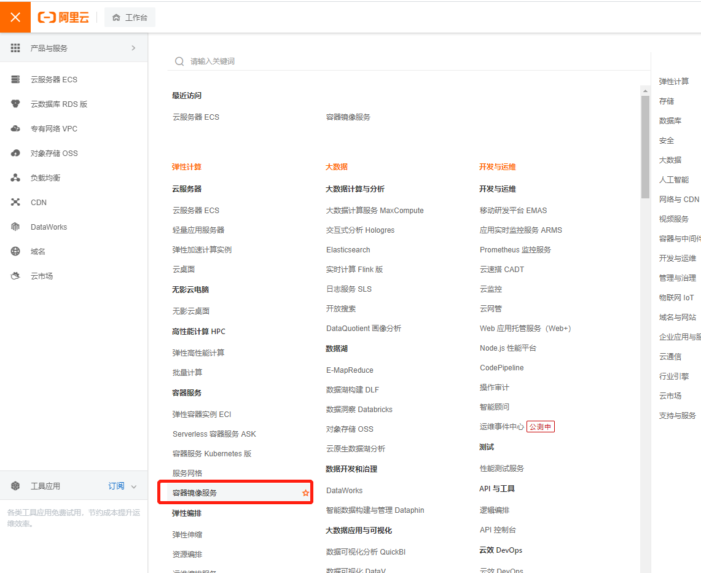

```shell
yum -y install gcc
yum -y install gcc-c++.x86_64
yum remove docker \
    docker-client \
    docker-client-latest \
    docker-common \
    docker-latest \
    docker-latest-logrotate \
    docker-logrotate \
    docker-engine
yum install -y yum-utils
yum-config-manager --add-repo http://mirrors.aliyun.com/docker-ce/linux/centos/docker-ce.repo
yum makecache
yum -y install docker-ce docker-ce-cli containerd.io
systemctl start docker
docker version

mkdir -p /etc/docker
tee /etc/docker/daemon.json <<-'EOF'
{
  "registry-mirrors": ["https://<!!!!这里要替换成自己的容器镜像服务!!!!!>.mirror.aliyuncs.com"]
}
EOF
systemctl daemon-reload
systemctl restart docker

```

<a name="uKAwj"></a>

## 容器镜像服务

1. 登录阿里云, 找到**容器镜像服务**这个选项



2. 找到镜像加速器复制URL, 替换当前脚本的url


