

## 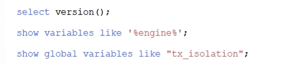

## 数据库事务的典型场景

1. 下单,资金,物流需要同时完成
2. 12306网站<接续换乘>功能, 需要买两张票作为中转站,所以两张票要同时购买成功. 

## 数据库事务

> 事务是数据库管理系统(DBMS)执行过程中的一个逻辑单位, 由一个有限的数据库操作序列构成.

## 数据库事务的四大特性

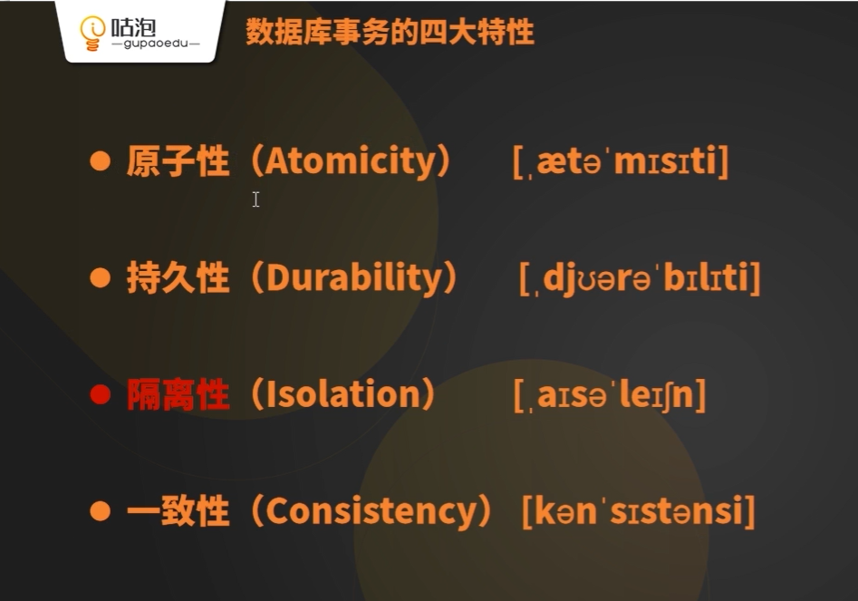
undo log 实现原子性
redo log 实现持久性
隔离性

开启事务:

1. DML自动开启事务
2. begin关键字

结束事务:

1. 自动提交 commit
2. rollback
3. 连接断开, 事务自动回滚.

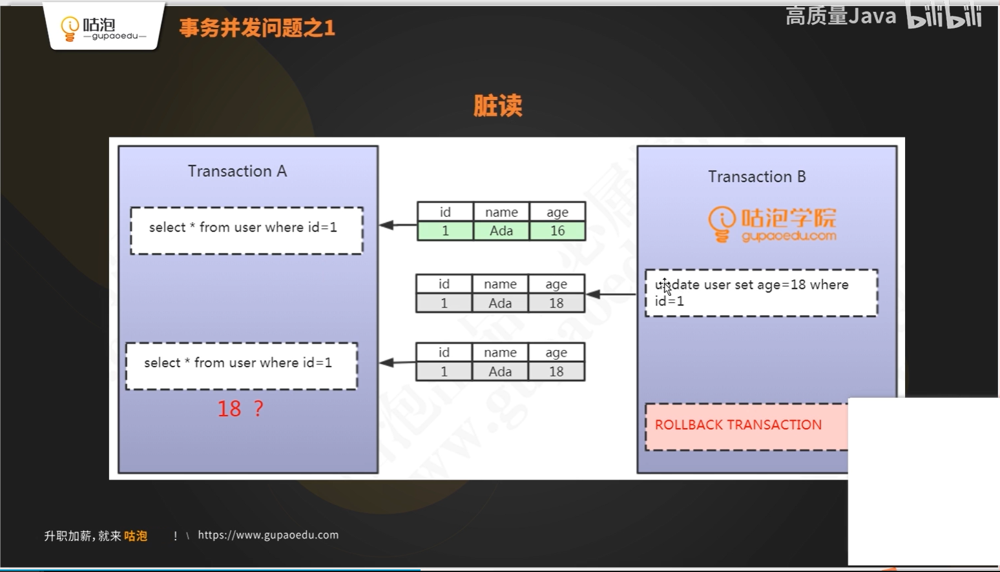
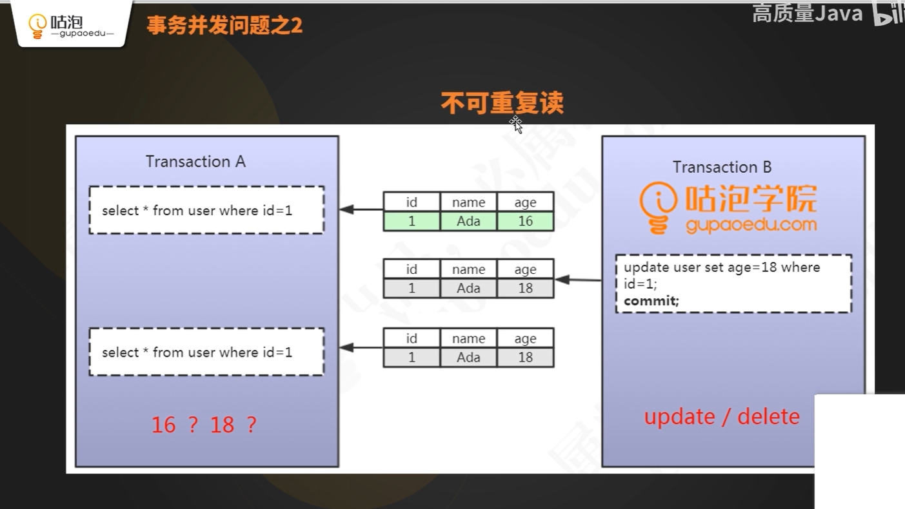	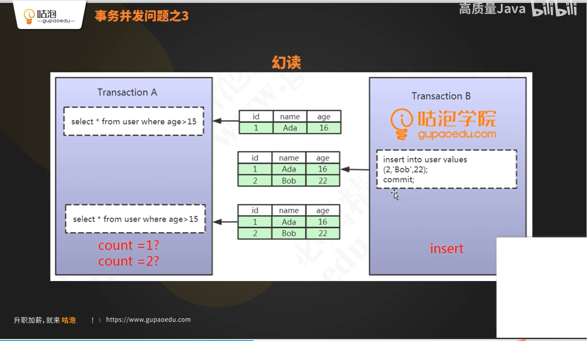

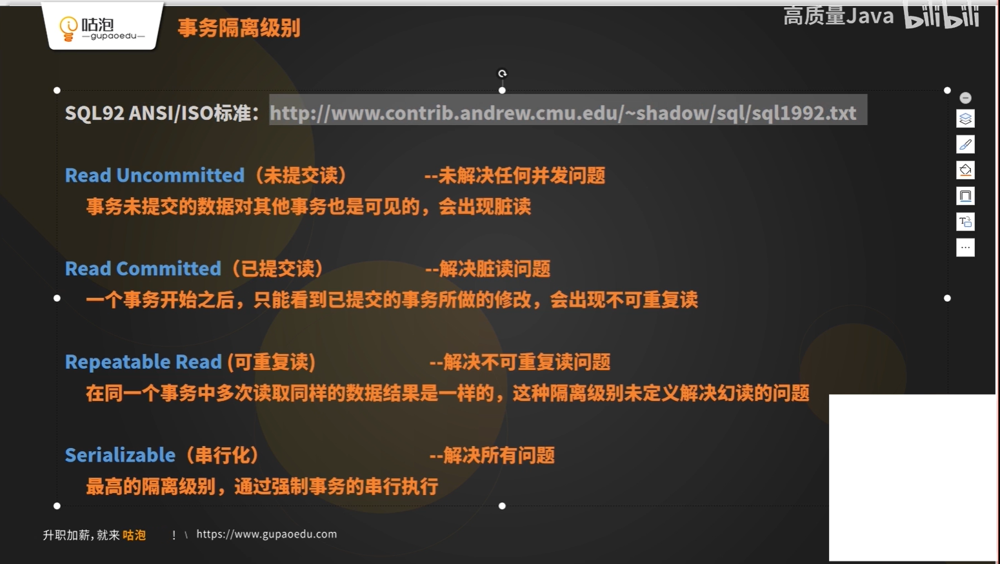
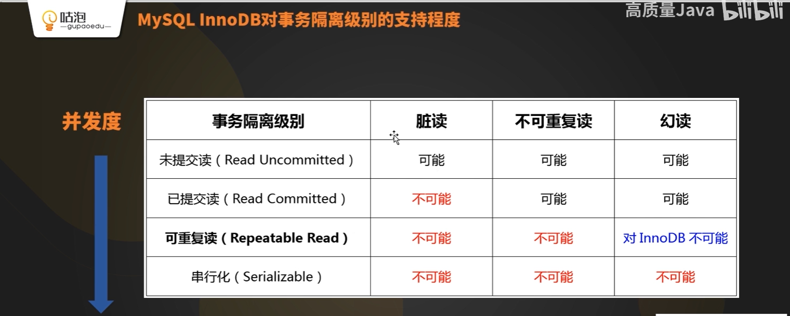

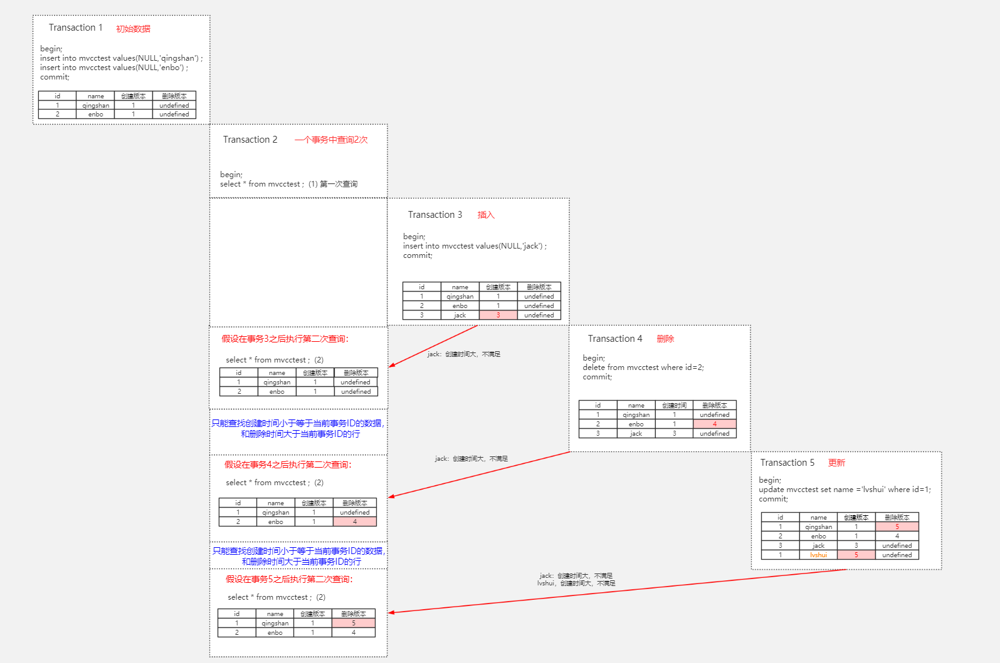
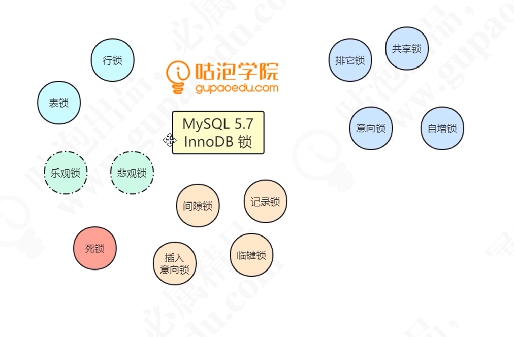

<https://dev.mysql.com/doc/refman/5.7/en/innodb-locking-transaction-model.html>

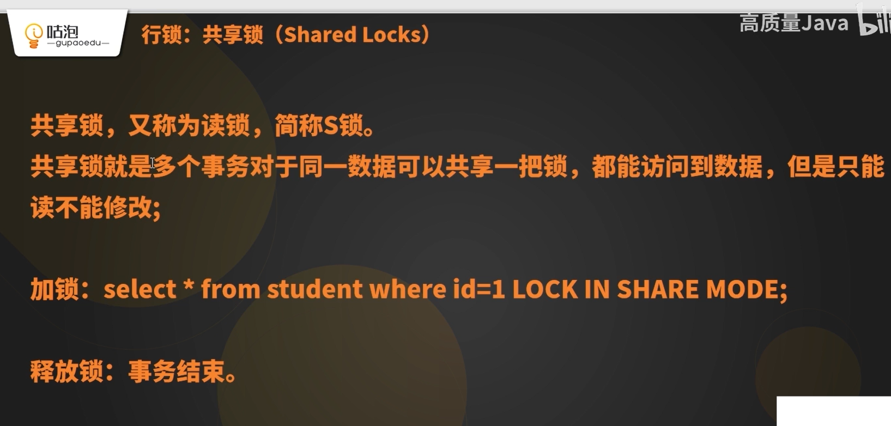

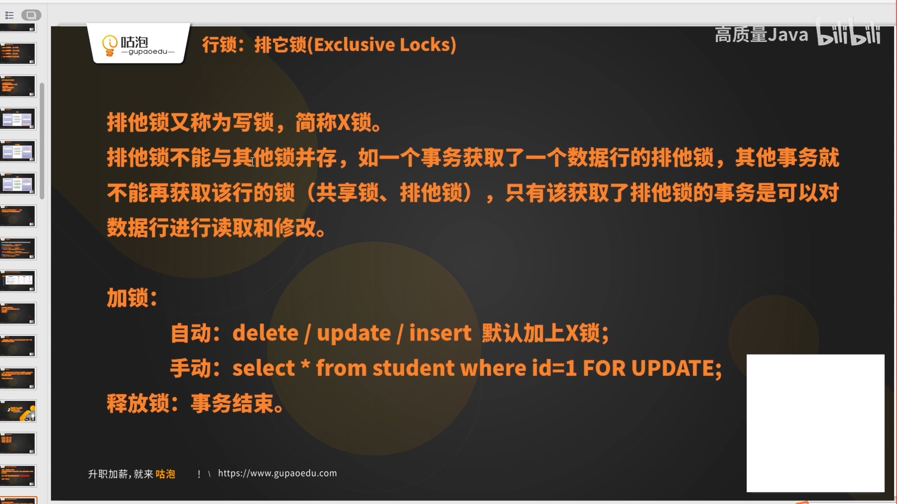

如果给一行数据加上共享锁, 那么存储引擎就会给**表**加上"意向共享锁"
如果给一行数据加上排他锁, 那么存储引擎就会给**表**加上"意向排他锁"

1. 为什么一张表没有索引, 加行锁会锁住整张表?

一张表可不可能没有索引? 不可能, 有隐藏的聚集索引
没有主键 -- 全表扫描  -- 把所有隐藏的聚集索引全部锁住

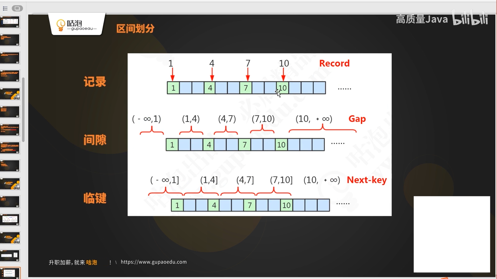
N 个 records
N+1 个 gaps
next-key: gap和右侧的record

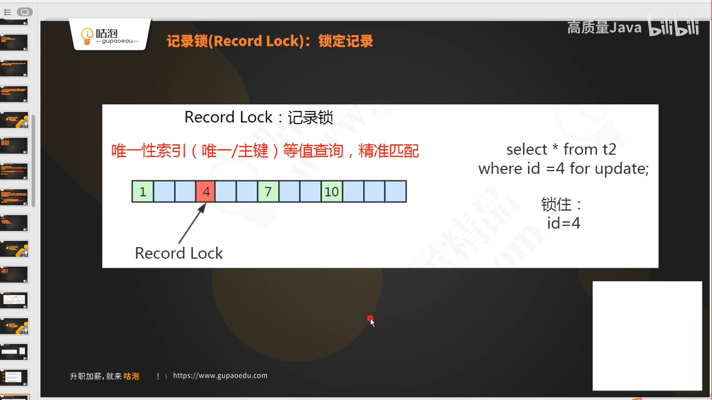
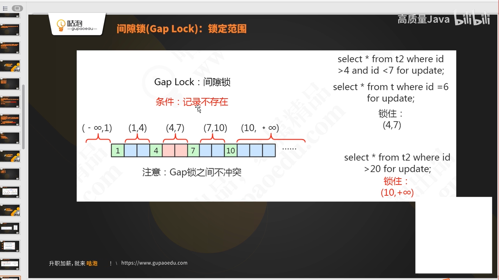
间隙锁最大的作用就是: 阻塞插入 -> 就是说可以解决幻读问题
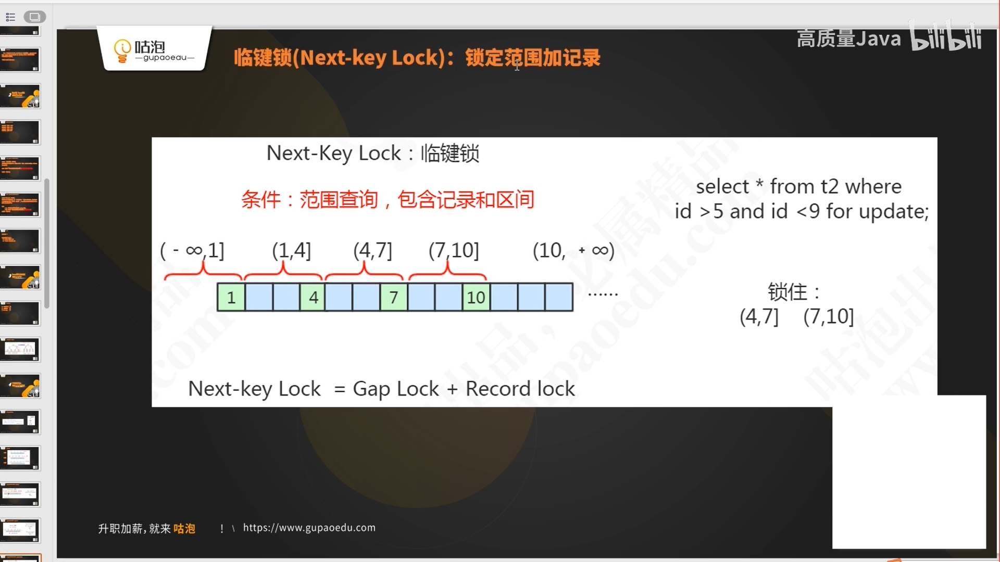
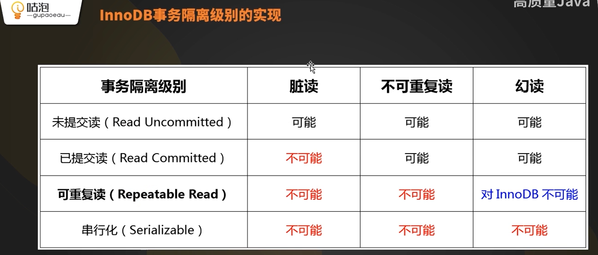

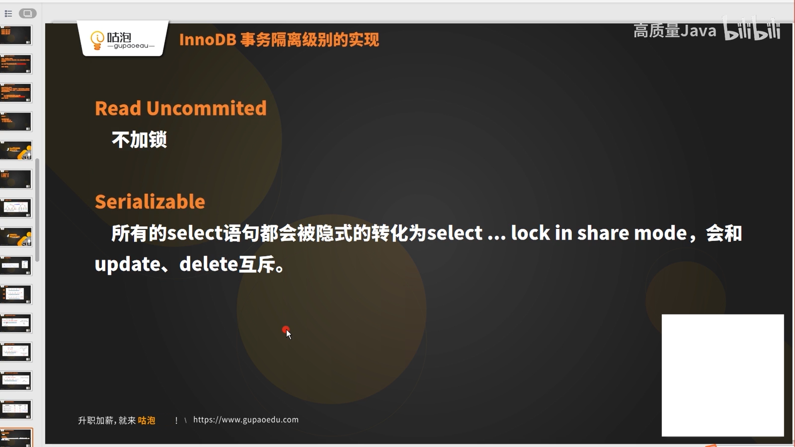
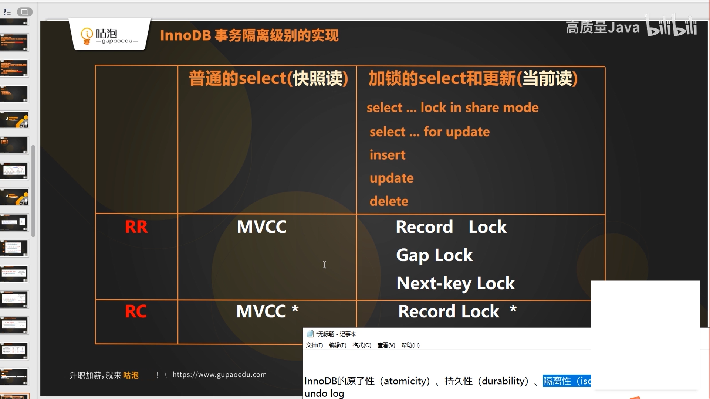
