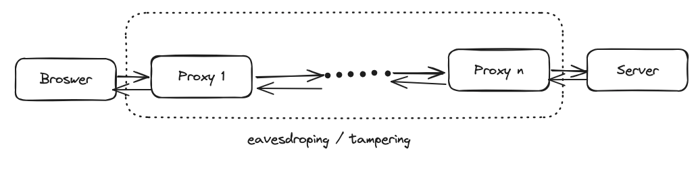

# HTTP篡改
## HTTP
### 原理
> HTTP does not encrypt data during client-to-server communication, which means that any data transmitted over HTTP is sent in plain text without any encryption or security mechanisms. As a result, it can be intercepted and read by anyone with access to the network traffic, including cybercriminals.
> Additionally, HTTP does not provide any authentication, making it vulnerable to man-in-the-middle attacks. Attackers can eavesdrop on communication between a server and a client, resulting in the theft of personal information such as login credentials and credit card numbers.

## 案例
### 运营商劫持
### 局域网劫持
### 公共wifi获取密码

## HTTPS
TLS(SSL) 传输层加密。

## 中间人攻击

## 证书机制

## Reference
https://gcore.com/learning/http-vs-https-security-comparison/#:~:text=HTTP%20does%20not%20encrypt%20data,the%20network%20traffic%2C%20including%20cybercriminals.
