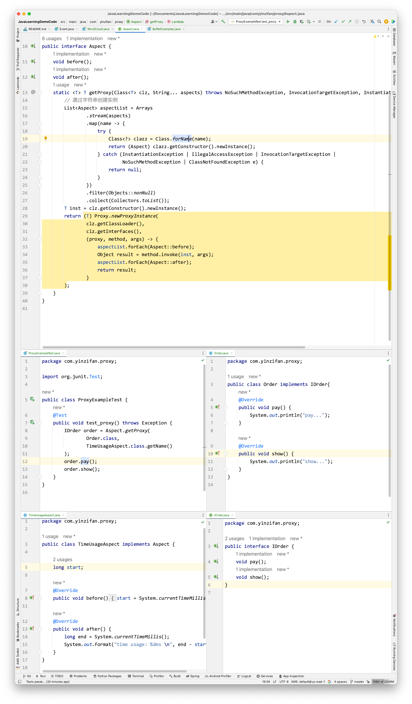

# 反射

## 面试题
1. 什么是反射？有什么用途？
2. 写一个关于反射的程序
3. 解释一下为什么要用面向切面编程？
4. 为什么Proxy.newProxyInstance要穿入ClassLoader？
5. 写一个程序实现AOP？

## 反射的概念
- 反射：运行时查看、反观程序内部结构，甚至修改
  1. 运行时数据（通常称为元数据MetaData - 模块、类、函数、注解、源代码。。）
- 通过字符串找到一个类，并且调用某个方法
- 查看类的方法、属性、注解
- 在运行时使用Javasist创建一个类

## 面向切面编程（Aspect Oriented Programming）
- 关注点分离原则（Separation of Concern）
- 理解切面
  - 程序有一个主关注点+其他关注点
  - 配置主关注点和其他关注点协同工作
    - When：何时触发？（before、after、around）
    - 触发的内容

## 代理
```java
public interface
```

### Proxy类
`proxy.pay` -> `invocationHandler.invoke` -> `order.pay`

### `Proxy.newInstance(classloader, interfaces, invocationHandler);`
#### 为什么需要`invocationHandler`？
#### 为什么需要`interfaces`?
#### 为什么需要`classloader`?
```java
@Test
public void test_proxy() throws InterruptedException {
    Order order = new Order();
    Proxy proxy = (IOrder) Proxy.newProxyInstance(
        Order.class.getClassLoader(), 
        new Class[]{IOrder.class},
        new Invocationhandler() {
            @Override
            public Object invoke(Object proxy, Method method, Object[] args) throws Throwable {
                System.out.println("before invoke method: " + method);
                return method.invoke(order);
            }
        }
    );
    proxy.pay();
}

```


