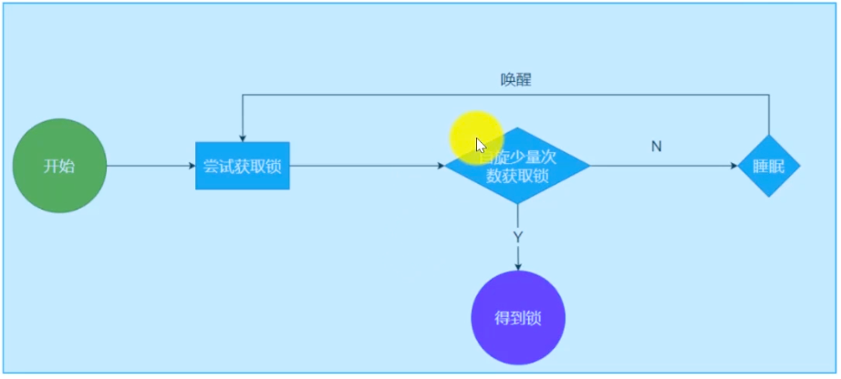

# synchronized

## 什么是同步

### 执行同步
1. 多个参与方
2. 汇合（Join）
3. 执行后续操作

### 数据同步
1. 多份数据保持一致
   1. 缓存和存储的同步
   2. 不同机房的数据同步

## Java下有哪些同步器


## synchronized是如何实现的
> 基于C和C++实现的Monitor

## ReentrantLock 和 synchronized 的区别
### synchronized支持Blocking 算法， 不提供Non-Blocking算法

### ReentrantLock的Non-Blocking算法(tryLock) + timeout

```java
Lock lock = new ReentrantLock();
try {
    lock.tryLock(1000, TimeUnit.MICROSECONDS);
} catch(InterruptedException e) {
   e.printStackTrace();
}
```

### ReentrantLock支持跨语句块

### ReentrantLock提供中断能力
```java

var t = new Thread(() -> {
    synchronized (lock) {
        for (int i = 0; i < 10000000; i ++) {
        }
        System.out.println("finished.");
     }
});;
t.start();
t.interrupt();
```

```java
Lock lock = new ReentrantLock();
var t = new Thread(() ->{
  int k=0;
  try{
    lock.lockInterruptibly();
    for(int i=0;i< 10000000;i++){
      k+=1;
    }
    System.out.println("finished.");
  }catch(InterruptedException e){
    e.printStackTrace();
  }finally{
    lock.unlock();
  }
});
t.start();
t.interrupt();
```
### 早期Java没有轻量级锁设计


## 为什么需要AbstractQueuedSynchronizer
1. 将Java开发者与真正意义的底层隔离 - 开发者实现同步控制算法时，不再需要使用JVM提供的最底层的API


```java
// 实现互斥锁
public class Mutex {
    private final Sync sync = new Sync();
    
    static class Sync extends AbstractQueuedSynchronized {
        protected boolean tryAcquire(int arg) {
            return compareAndSetState(0, 1);
        }
        protected boolean tryRelease(int arg) {
            return compareAndSetState(1, 0);
        }
    }
    public void lock() {
        sync.acquire(0);
    }
    public void unlock() {
        sync.release(0);
    }
}

```

## synchronized 关键字的设计思路
### 用法
```java
   synchronized (obj) {
   // 临界区代码
   }
```

### 一种不完全的实现方案
```
enter(&lock) {
   while( !cas(&lock, 0, 1)) {
      // 休眠
      // 1. 休眠少量CPU周期（自旋锁）
      // 2. 定时休眠（Thread.sleep()）
      // 3. 信号休眠、信号唤醒（类似于wait/notify）
   } 
   
   leave(&lock) { lock = 0; }
   
   enter(&obj.lock)
   // 临界区代码
   leave(&obj.lock)
}
```

### 修改后的方案


### 睡眠/唤醒一个线程的能力时如何实现的？
1. 操作系统的API修改线程状态 - READY -> SLEEPING
2. JVM知道那些线程在休眠 - WaitSet

### 实现一个synchronized关键字的思路
1. 需要实现加锁/解锁的逻辑
2. 需要自旋锁到休眠的升级逻辑
3. API设计：任何对象都可以上锁
4. 线程可以在竞争不到资源时进行休眠
5. 释放资源时唤醒休眠线程 -- 需要知道有哪些线程正在休眠

### Monitor

1. 每一个Object都绑定了一个Monitor
2. 线程抢占锁，本质上就是抢占Monitor（将Monitor的owner设置为该线程）
3. 没有抢占到锁的线程，会自旋竞争，Monitor内部实现了等待集合，没有竞争到资源的线程自旋失败后，会在WaitSet中休眠等待被唤醒

### JVM的Monitor指令
1. monitorenter
   - 如果获得锁，则进入临界区代码
   - 没有获得锁，先会进行自旋，然后休眠，进入WaitSet
2. // 进入临界区
3. monitorleave
   - 唤醒

### Monitor的更多设计因素
#### 线程间协作

##### Java如何实现生产者/消费者？

##### 读/计算/写 模型
1. Polling - while循环不断检查有没有新的读入
2. Queuing
   - 使用Java的`wait()`和`notify()`实现生产者消费者模型
   1. 队列满了 - 生产者休眠
   2. 队列空 - 消费者休眠
   3. 消费者开工 - 唤醒生产者
   4. 生产者开工 - 唤醒消费者

## 偏向锁、轻量级锁、重量级锁
> 高并发场景自旋锁(spin-lock)带来的灾难。如果每个线程都自旋15次没有获得锁就休眠，那么10ms足够所有线程自旋15次
> 在这种情况下，我们将竞争10ms的操作修改为竞争进入EntrySet（链表）的权限，只要能够成功插入链表，就代表竞争到了资源（这种情况下，使用的是

### 偏向锁

### 轻量级锁

### 重量级锁

