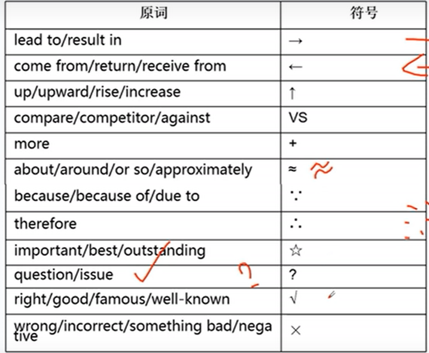

## 

## RS

- 追求流利度和发音，不要过度追求内容
- 专心听不做笔记
- 组织好语言再作答 

### 有關 bibliography 所有RS 包括

\#369
All filed assignments should have a full list of bibliography.
\#380
A full list of bibliography is needed at the end of all filed assignments.
\#449
A preliminary bibliography is due the week before the spring break.
\#757
If you want to sell all your books, it must have a list of bibliography.
\#807
All sources of materials must be included in your bibliography.
\#961
A thorough bibliography is needed at the end of every assignment.
\#351
Any textual references you make should be cited appropriately in the bibliography.
\#1666
Marks will be awarded for a bibliography in the correct format.
\#2145
The bibliography needs to be removed prior to the publication.
