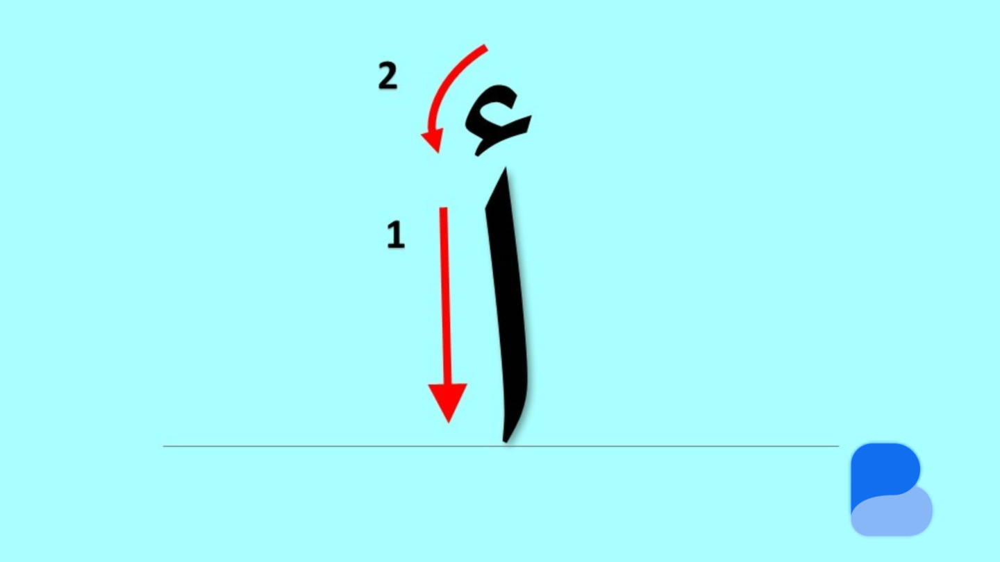
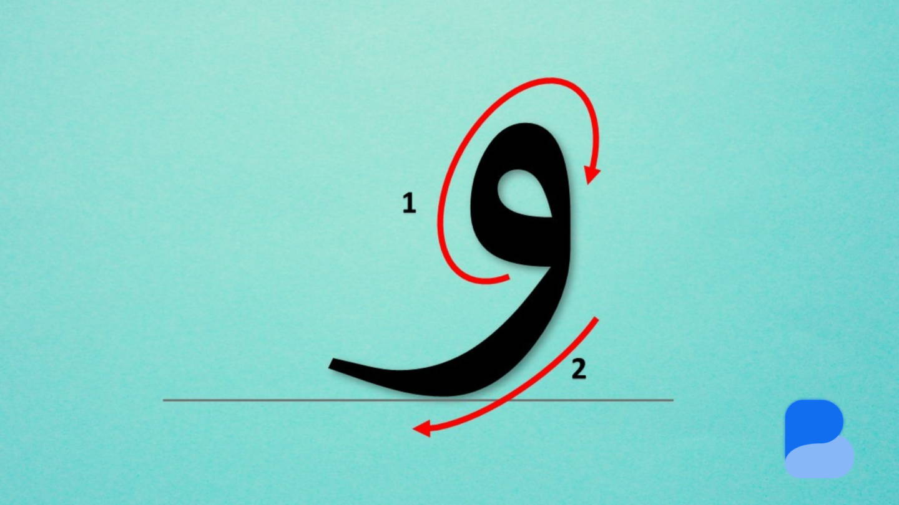
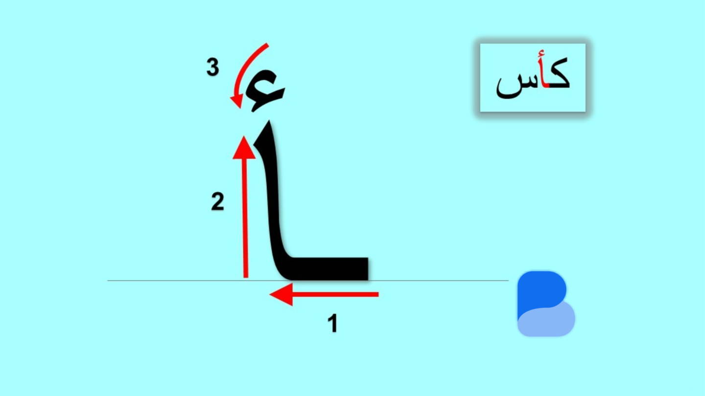
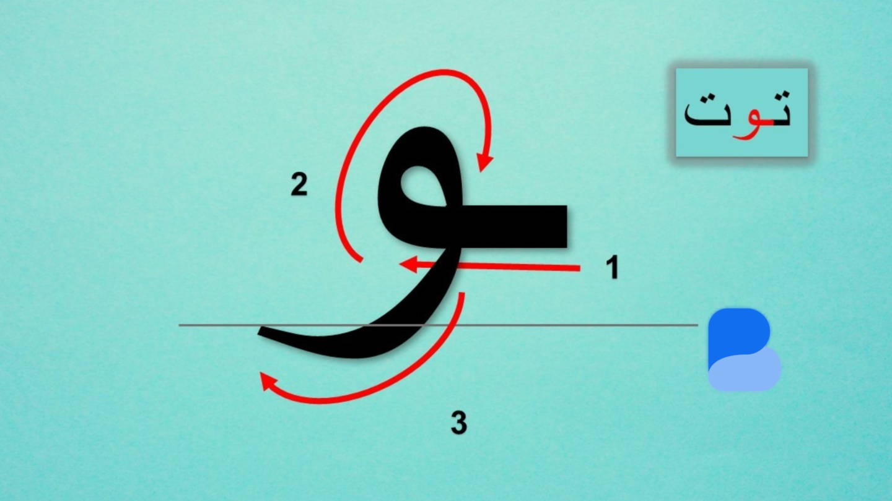

アラビア語は筆記体を使う言語なので、全ての文字が繋がっています。ただし、後の文字が繋がらない文字が 6 つあります。😒👽😉 **أ - و - د - ذ - ر - ز**
このレッスンでは、そのうちの 2 つ **أ - و **独立形と語中形を学びます。
名前はローマ字で書いています。始めましょう!

| **文字の名前** | **独立形** | **語中形** |
| --- | --- | --- |
| Alif | أ | ــأ |
| Waw | و | ـــو |

アラビア文字を学ぶ中で、**文字の名前**と**文字の音**を確認していきます。両方を知っておくことが大切です!次の画面の音声では、最初に文字の名前、それから音を聞きます。その前に、今回のレッスンの文字を見てみましょう。

| **文字** | **文字の名前** | **文字の音** |
| --- | --- | --- |
| **أ** | Alif | aa |
| **و** | Waw | wa |

単語の中で繋げた形を学びましょう。右側だけが繋がります。
繋がらない文字とその後の文字には、必ず隙間があります。

| **ولد** (少年) | Waw は最初の文字で、同じ単語の後の文字と繋がっていません。これは**独立形**です。 |
| --- | --- |
| **موعد** (約束) | Waw は同じ単語内の直前の単語と繋がります。これは**語中形**です。 |

- فأر ネズミ
- وردة バラ
- حلوى スイーツ
