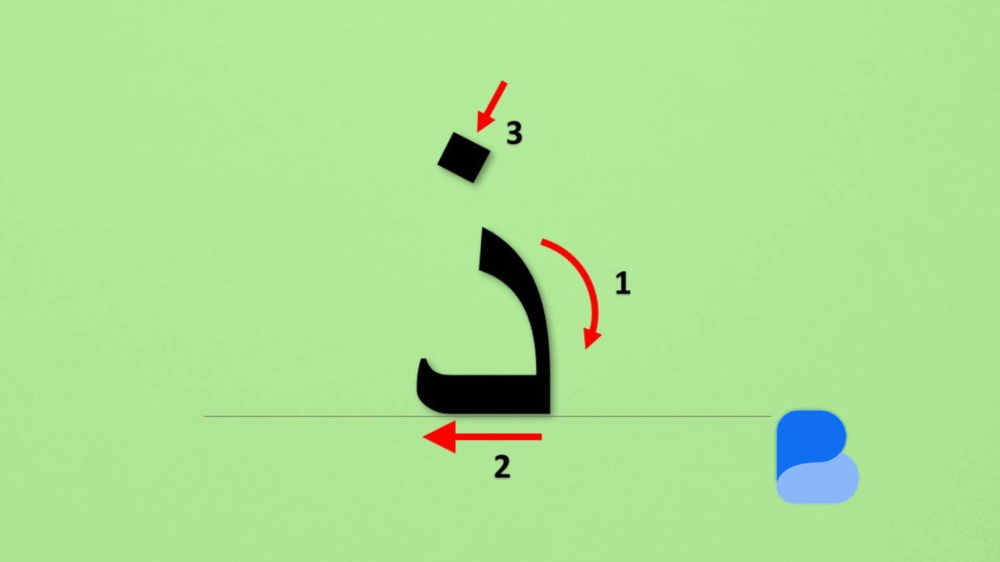

**繋がらない文字 د - ذ**
このレッスンでは、さらに 2 つの繋がらない文字 **د - ذ** の独立形と語中形を学びます。
名前と音はローマ字で書いています。始めましょう!

| **文字の名前 / 音** | **独立形** | **語中形** |
| --- | --- | --- |
| Dal / da | د | ــد |
| Dhal / dh | ذ | ــذ |

語中形: **ــد (Dal)** と **ــذ (Dhal)**
يد
手
لذيذ
美味しい

- صندوق箱
- **دواء (医療) **
