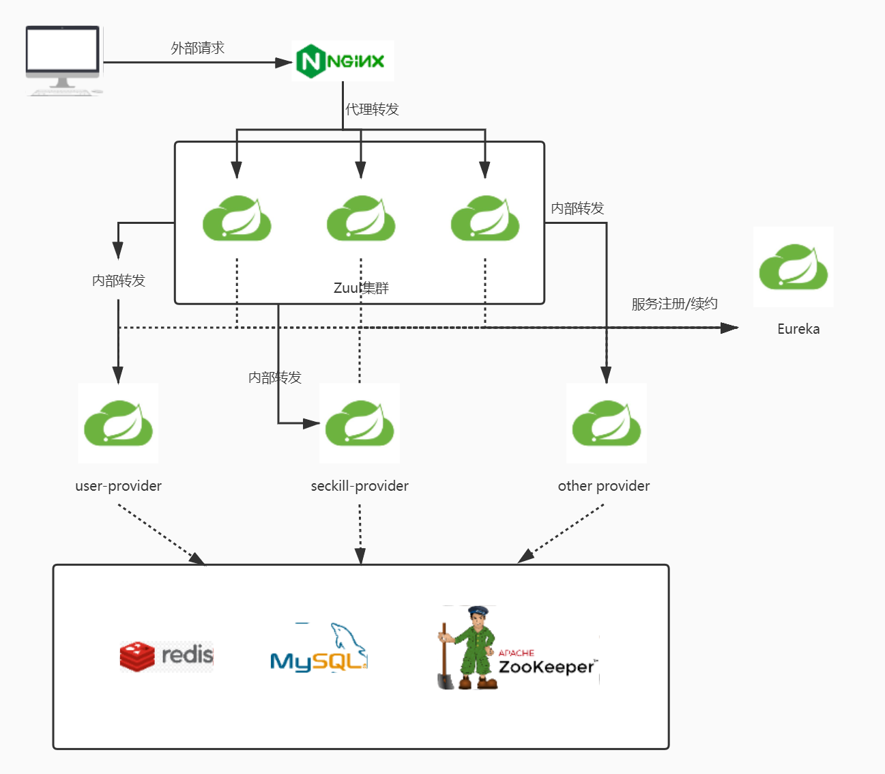

<a name="bKZ2Y"></a>

## 第一章： Spring Cloud + Nginx高并发核心编程的学习准备

如标题所言，在进行学习前进行的软硬技能的准备工作，主要包括： <a name="CPbPi"></a>

### 1. Spring Cloud + Nginx架构的主要组件一览及架构介绍：



<a name="Y2Q64"></a>

### 2. Spring Cloud与Spring Boot的版本选择

| Spring Cloud | Spring Boot |
| --- | --- |
| Camden | 1.4.x |
| Dalston | 1.5.x |
| Edgware | 1.5.x |
| Finchley | 2.0.x |
| Greenwich | 2.1.x |
| Hoxton | 2.2.x |

本书中使用的Spring Cloud 和 Spring Boot版本为：

```xml
    <dependencyManagement>
        <dependencies>
            <dependency>
                <groupId>org.springframework.cloud</groupId>
                <artifactId>spring-cloud-dependencies</artifactId>
                <version>Finchley.SR4</version>
                <type>pom</type>
                <scope>import</scope>
            </dependency>
            <dependency>
                <groupId>org.springframework.boot</groupId>
                <artifactId>spring-boot-dependencies</artifactId>
                <version>2.0.8.RELEASE</version>
                <type>pom</type>
                <scope>import</scope>
            </dependency>
        </dependencies>
    </dependencyManagement>
```

<a name="Eg2Jc"></a>

### 3. 书中涉及到的中间件

| 中间件 | 端口 |
| --- | --- |
| Redis | 6379 |
| ZooKeeper | 2181 |
| RabbitMQ | 3306 |
| Spring Cloud Eureka | 7777 |
| Spring Cloud Config | 7788 |
| Zuul | 7799 |
| Nginx/OpenResty | 80 |

<a name="Jxa3c"></a>

### 4. 微服务开发及环境自验证

作者推荐:

1. 提前暴露生产环境中的问题, 在虚拟机中装在CentOS作为自验证环境
2. 使用Shell命令和脚本来定位问题和运维
3. 使用环境变量的占位符来代替直接硬编码在配置文件中的变量,如:

```yaml
eureka:
	client:
  	serviceUrl:
    	defaultZone:
      	${SCAFFOLD_EUREKA_ZONE_HOSTS:http://localhost:7777/eureka/}
```

所以可以将系统中的环境变量写在	`/etc/profile`, 如:

```shell
export SHAFFOLD_DB_HOST=192.168.233.128
export SHAFFOLD_DB_USER=root
export SHAFFOLD_DB_PWD=root
export SHAFFOLD_REDIS_HOST=192.168.233.128
export SHAFFOLD_REDIS_PWD=123456
export SHAFFOLD_EUREKA_ZONE_HOSTS=https://192.168.233.128:7777/eureka/
export RABBITMQ_HOST=192.168.233.128
export SHAFFOLD_ZOOKEEPER_HOSTS=192.168.233.128
```

同时将不同服务都配置为域名的形式, 直接通过修改本地hosts文件的形式来修改域名指向, 如:

    127.0.0.1  crazydemo.com
    127.0.0.1  file.crazydemo.com
    127.0.0.1  admin.crazydemo.com
    127.0.0.1  xxx.crazydemo.com

    192.168.233.128  eureka.server
    192.168.233.128  zuul.server
    192.168.233.128  nginx.server
    192.168.233.128  admin.nginx.server
